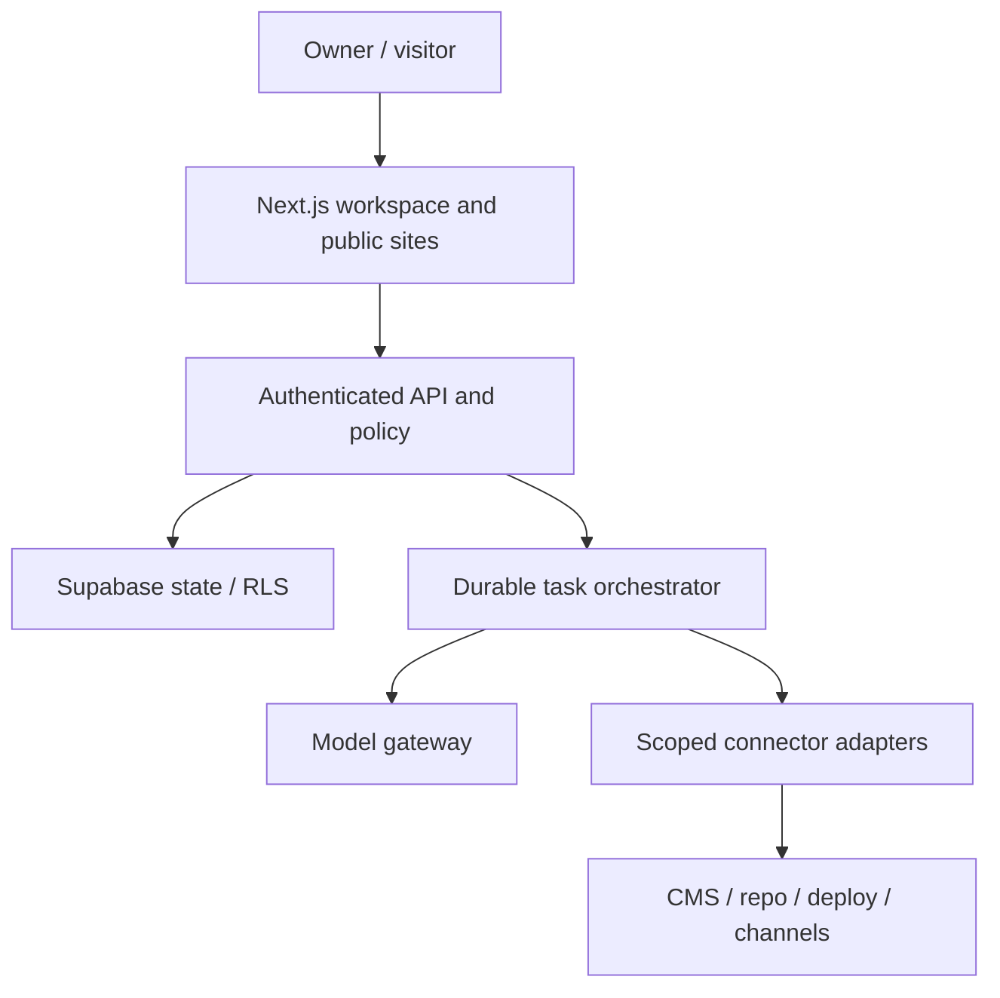

# System architecture

**Current package1.7:** public/admin host ownership has changed. Read the Package1.7 section below and document24 before applying older setup instructions.

**Draft 0.1.** Current facts are inferred from the archived source; the target is a proposal subject to ADRs and proof.

## Current boundary

The V27.12 Next.js App Router app hosts onboarding, Studio, public portfolio rendering and API routes. Supabase holds authenticated projects, revisions/publications, opportunity variants, knowledge and visitor records via migrations 001–017. AssemblyAI routes support voice sessions. `src/lib/agent-provider.ts` has configurable Nebius/OpenRouter/Gemini/OpenAI candidate selection, but a live qualifying model call is unverified. Browser/client calls must go through authenticated server APIs for private actions. `package.json` version `26.0.0` differs from the V27.12 archive label; release/version policy must be reconciled.

## Target components

Native site flow: onboarding→typed site content→preview→approved revision→publication snapshot→public URL. Connected flow: site registry→capability discovery→authorized adapter→diff/draft/PR→human approval→external receipt→readback. Operations flow: owner request→scope/permissions→plan→typed task graph→bounded worker→checkpoint→artifact/approval→external action→receipt→audit. Model outputs are treated as untrusted data, validated before creating tasks or tool calls. An API worker or queue design is required before any long-running or retryable task; Vercel request handlers alone must not be presumed durable.

## Invariants and failure boundaries

- All state-changing jobs carry workspace/site IDs and requester identity; authorization is checked at every boundary, not inherited from a prompt.
- External content is authoritative in its CMS/repository; Bizoveya stores snapshots/proposals/receipts and reconciles conflicts. Native sites retain Voxfolio's revision and snapshot protections.
- Each external action uses a stable idempotency key and records intent, result and readback. On timeout, first reconcile remote state; never blindly retry publish.
- Pausing a task cannot rewind a successful external action. A cancelled meeting/task retains its audit. Secrets are retrieved server-side by scoped connector.
- Public chat has separate approved-public knowledge, rate limits and consent; it cannot retrieve private meeting notes.
- Degraded mode: failed model leaves an editable draft; failed connector keeps proposal; expired credentials show reconnection; no automatic fallback that changes provider cost/policy without configured permission.

## Decisions to prove

Audit old workforce dashboard for reusable components/schema against auth and migration collisions. Choose queue, worker and hosting after idempotency exercise. Determine native business-site public-domain routing and preview isolation. Define model gateway policy by task and cost. Each choice gets an ADR with alternatives, measured evidence, migration and rollback.

## Implemented P01.0 documentation slice

`src/features/document-room/documents.ts` reads `docs/platform/*.md` and `docs/platform/decisions/*.md` on the server. The `/bizoveya/docs` route derives progress and navigation from canonical files; the dynamic `[slug]` route uses `generateStaticParams`, allowlisted slugs and a Markdown renderer. Search operates on text sent to the client; Mermaid renders in the browser. Redeployment rebuilds pages from the current repo. No separate Sites service or duplicated document database exists. Public visibility is owner-directed and requires source review before deployment.

## Configurable backend extension (ADR-0002; planned)

The inherited app already has a backend. Extend it with authenticated platform administration, a versioned configuration store, approved model catalog, secret references and a worker/runtime interface. Admin → authenticated policy API → draft/tested config versions → active pointer → immutable run snapshot → SDK/runtime → policy-controlled adapters. Client instructions are scoped inputs; permission decisions remain server-enforced. See [18_BACKEND_AND_ADMIN_CONTROL.md](18_BACKEND_AND_ADMIN_CONTROL.md) for the topology and contracts.

Prefer an application-run reusable SDK with replaceable provider adapters; OpenAI Agents SDK is a candidate, not installed or selected. Managed Agents API is a different deployment choice that may reduce runtime work; no arbitrary third-party-model support or borrowed ChatGPT/Muse session is assumed. Validate SDK compatibility with actual Nebius model tool/structured-output behavior before choosing. Model intelligence does not remove the integration/policy/receipt layer.

Configurations and QA rules can be changed without code deployment within supported schemas. New executable tools, validators or template components still require software releases. Atomic version activation and pinned run snapshots prevent global rule edits from changing running tasks invisibly. Credentials are server secret references, separate from instructions; rotation/revocation preserves audit and reconciles in-flight actions. This package adds no SDK, queue, admin API or SQL.

## Package 1.3 transition and impact synchronization

The first slice extends existing server APIs and portfolio command/revision code with authenticated workspace/site boundaries; frontend and backend are implemented together. [19_DEPENDENCIES_AND_CHANGE_IMPACT.md](19_DEPENDENCIES_AND_CHANGE_IMPACT.md) defines capability ownership, typed agent handoffs, proposed domain events and transitive impact review. [20_ROUTE_AND_TRANSITION_REGISTER.md](20_ROUTE_AND_TRANSITION_REGISTER.md) specifies route states and additive migration/rollback boundaries. No runtime dependency-controller service or new worker is installed in 1.3.

## Package 1.4 — first practical workspace implementation

The P01.3 vertical slice is implemented through `src/domain/workspaces.ts` (schemas/capability labels), `src/features/workspaces/store.ts` (permission-scoped persistence), `api.ts` (session, input/error/CSRF boundary), `page-data.ts` (server-page session/load states), client forms/frame and server pages. Cookie-based Supabase sessions use the existing server client and anonymous key; no service-role credential is introduced.

Every page/API request checks the verified user; membership/entity checks occur at data access. Database SELECT policies and guarded RPCs provide a second boundary. RPCs create workspace+owner membership atomically, guard writer roles and owned projects, and reject stale versions. Direct table writes and self-granted memberships are not exposed. No model, queue, dependency-controller service or external-site fetch is added. See document 19 for precise impacted boundaries and document 20 for routes.

## Package 1.5 — admin access boundary

`src/features/admin/access.ts` verifies the user with the existing Supabase cookie client and fetches current DB eligibility. `page-data.ts` routes sign-in/MFA/denial states; `api.ts` returns sanitized private/no-store JSON; `store.ts` validates aggregate/audit responses. Server pages pass minimal data to the UI. `mfa.tsx` uses the existing browser client and Supabase TOTP APIs; setup secrets remain in component memory and are never added to project logs/storage. Security setup permits eligible AAL1; global data requires AAL2.

Migration 019 places grants/audit in `bizoveya_private`, with operator-only issuance and guarded SECURITY DEFINER RPCs using a fixed empty search path. Global summary/audit RPCs recheck grant and JWT assurance in the same DB request. No provider, service-role key, queue or runtime SDK is introduced. Existing workspace/project policies are unchanged. See runbook 21 for lifecycle and recovery limits.

## Package1.6 — source-derived release metadata and isolated verification

`latestPackage()` in the document insights module parses recorded release-table rows numerically and is shared by overview/detail pages. Counts come from the same document loader used to render the library. No duplicate runtime release constant is maintained. Migration020 replaces only the operator grant/revoke function: eligibility is checked for new grants, while revocation remains available after soft deletion.

`tools/phase1-verification/` is a separate development harness with ephemeral PostgreSQL WASM and local browser runners, not another production database, app service or deployment target. Its Auth/Storage/JWT fixtures are deliberately simplified; application server/client architecture and provider choices remain unchanged.

## Package1.7 — separate admin application (current contract)

This section supersedes earlier same-host admin/source-path instructions for the current package, while preserving those earlier delivery records. Under ADR-0004, public code is apps/web/src; admin code is apps/admin/src. Source folders are not URL prefixes. The main host has no /admin or /api/admin pages/handlers, no admin button or redirect. Admin-only paths belong to the separate host; / redirects to its /login, with approved-role/MFA checks for protected pages/APIs. Admin has no customer/docs/marketing routes. All canonical Markdown remains at root docs/platform and is visualized only by the main app. Both deploy independently from one repository/ZIP; shared Supabase/migrations remain centrally managed. See23 for founder-reported testing,24 for explicit install/deploy/environment/manual instructions, and ADR-0004 for the decision. No new migration or live domain configuration is delivered. Real admin Auth/MFA, tenant isolation and production acceptance remain pending. Current source paths elsewhere in prior historical sections must be interpreted through this ownership map.
