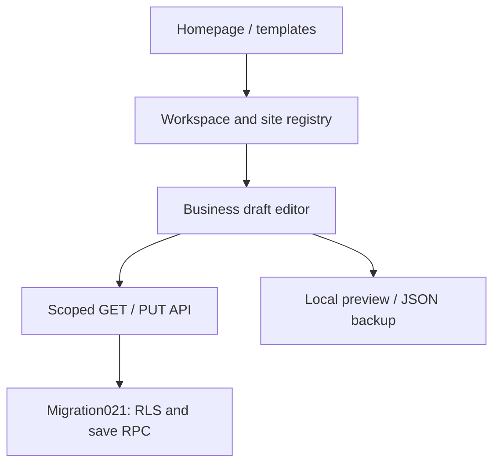
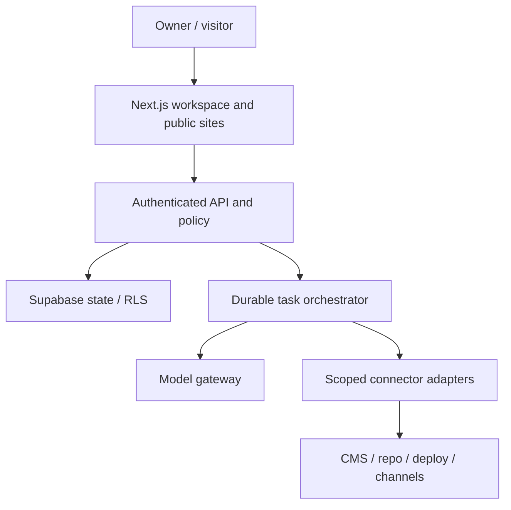

# System architecture

## Current checkpoint — 1.20 / P04.3.3.1

Private campaign draft storage is implemented at `/workspaces/[workspaceId]/sites/[siteId]/campaigns`, with saved campaign URLs ending in `/[campaignId]`. This checkpoint stores manually authored brief/blog/Pinterest/LinkedIn text; it makes no model request and does not publish. Additive migration033 follows032. P04.3.3 remains in progress: bound-agent orchestration, generation reservations, durable execution/usage and output review are the next work on the SAME `phase/p04-3-3-durable-drafts` branch. See [40 Campaign drafts](40_CAMPAIGN_DRAFTS_AND_TESTING.md).

Founder screenshots on2026-10-03 confirm Gemini connectivity and MT107 settlement:20 input/7 output tokens, pricingv1, held/count amounts$0, run `e5be1ac3-5620-40e0-9498-97febb96fb15`. MT103 saved policy/history is evidenced; refresh persistence is not separately reported. Other unevidenced manual gates stay pending. Pakistan Token Factory onboarding is blocked; Builder application is under review. Nebius support email was drafted for the founder, not sent by the assistant. No main merge, production deployment, hosted SQL or provider call performed.

## Historical contract — 1.19 / P04.3.2

This update supersedes conflicting older “current” blocks below; historical records remain unchanged. Admin-only spending controls are at `/admin/spending` and `/api/admin/spending`. Migration032 follows031; never rerun applied migrations. New connectivity tests require reviewed USD pricing and enabled limits. The ledger reserves a conservative estimate before a provider call, settles reported usage, and holds uncertain/overrun charges until evidence-based reconciliation. Customer draft generation and publishing remain disabled. See [39 Spending controls](39_SPENDING_CONTROLS_AND_TESTING.md).

Founder reported all1.18 MT095–101 passed on2026-10-03; this is founder-reported local acceptance, not independent deployment verification. New MT102–109 remain pending. GitHub write access is restored; delivery uses `phase/p04-3-2-spending-controls`, not main. Main was inspected at1.7; this branch carries cumulative1.19 source. See38 and CONTINUATION for delivery state.

## Historical snapshot — 1.18 / P04.3.1

Reviewed model assignments are implemented at `/admin/bindings` and `/api/admin/bindings` on the separate admin host only. Migration 031 is additive after 030. An assignment pins a checked latest preview-approved agent version, matching-tier checked model profile, enabled credential-reference version and successful matching connectivity-test ID. Evidence must remain less than 24 hours old. Version changes, rotation, revocation or expiry require review; disable retains history. This is assignment configuration, not paid execution, budget enforcement or customer draft generation.

Use [37 Agent model assignments](37_AGENT_MODEL_ASSIGNMENTS.md) for setup and pending MT095–101. Next are P04.3.2 spending controls, P04.3.3 durable text drafts, and P04.3.4 visual composition. Publishing remains deferred. The founder's successful local Gemini test is accepted only for the evidenced case; all other unevidenced manual tests stay pending.

The founder approved one branch/PR per phase and six-hour continuation. GitHub reads succeeded but branch creation returned HTTP403 `Resource not accessible by integration`. No remote branch, commit or PR was created. The schedule was created then paused pending write access. See [38 Delivery and continuation](38_DELIVERY_AND_CONTINUATION.md). Earlier contracts below remain historical where superseded.

## Current contract — package1.17 / P04.0

P04.0 adds an admin-only model connectivity room at /admin/model-tests and /api/admin/model-tests. The saved provider/model uses the AI SDK with fixed OpenAI, Nebius Token Factory and Gemini adapters. It sends a fixed synthetic prompt, requests128 output tokens, waits20 seconds, makes no automatic retry/fallback, and stores redacted results with profile/reference versions, actor, reason and timestamps. No customer knowledge or prompt is sent. This is connectivity evidence, not quality evaluation, agent activation or a spending-budget implementation.

Live tests default off. Explicit operator setup requires the selected private provider key plus an admin-only SUPABASE_SERVICE_ROLE_KEY for server-attested result recording, then BIZOVEYA_ENABLE_MODEL_TESTS=true and per-request pricing/charge acknowledgement. No secret-entry form exists. Named current admin+AAL2 is required; client roles cannot mark results passed. Additive030 enforces one running test and five attempts per UTC day platform-wide, durable request IDs, expiry/unknown states and version-sensitive evidence. Failures/unknown attempts still consume the attempt allowance and may be billed. Existing dailyBudgetCents remains planning metadata; monetary enforcement precedes customer runtime.

Read36_MODEL_CONNECTIVITY_AND_TESTING.md for exact setup, supported evidence and MT087–094. All1.16 tests and earlier unevidenced founder gates stay pending; the founder is currently testing and has supplied no new pass results. Preserve001–029 and historical files. One cumulative ZIP/repository and the same two Vercel roots. No hosted SQL/deploy/provider request was performed by the assistant. Next implementation dependency: reviewed exact-model evidence, agent/profile binding, enforced monetary limits and durable draft runs, then visual output composition. The35 draft-only pilot and34 Studio/removal scope remain in force; publishing remains deferred.

Earlier release contracts below are historical and superseded where they conflict with this current contract.

## Historical contract — package1.16 / P02.5

The initial new-website audience is freelancers, consultants and small digital-service agencies. Existing sites remain niche-independent registrations. P02.5 repairs Studio and adds owner-only permanent site-record removal: collapsible workspace navigation (collapsed on Studio entry), bounded independently scrolling panels, whole-card section selection, canvas-local selected-section scrolling, homepage Hero/FAQ placement rules, explicit legacy order repair, 120-character headline/320-character hero introduction with counters, bounded responsive photo frames with fitting/focus, optional shared HTTPS logo, sample-fill with confirmation/Undo, section navigation/mobile menu and focused Professional Practice/Creative Business styling. Shared rendering serves preview and existing snapshot publication. No silent legacy row rewrite or automatic sample save/publish.

Additive029_business_studio_and_site_removal.sql preserves001–028. It accepts optional logo/photo metadata, keeps legacy read compatibility, enforces editorial rules on new saves/publication, and exposes owner-only version/name-confirmed bz_delete_site. Site removal cascades this site's business draft/public snapshots/history, knowledge/revisions/events and agent preferences, retaining a content-free owner-readable removal event. External hosting and original portfolio projects remain intact. This is permanent removal, not archiving/restoration. Old duplicate records are removed individually by their owner; no automatic merge.

The first agent pilot is now drafts only for doitwithai.tools: blog, Pinterest copy+rendered graphic, LinkedIn post and rendered carousel/PDF. This phase documents the pilot; live model execution and visual generation are not implemented here. Five proposed roles (coordinator, writer, QA, Pinterest, LinkedIn) share a future visual composer. Social OAuth and CMS writes are not prerequisites for draft generation. Model provider qualification/binding/enforced budget and stored runs remain prerequisites. Multipage/custom collections/listing-entry/navigation/media uploads/gallery/video blocks remain planned; current business sites still have one homepage with section navigation.34 contains current repairs/manual cases;35 contains pilot briefs and owner-reviewable starter knowledge.30 remains cumulative.

Founder reported all newly created Supabase files applied in the review; record this as founder-reported through028 setup, not independently verified database state. Studio/onboarding/deletion findings are open until owner retests1.16. Earlier unspecified acceptance/security gates remain pending. This is a living plan; subsequent founder instructions can revise it, with affected documents, code, migration, dependency and activity records updated together. One cumulative ZIP/repository, two existing Vercel app roots. No remote database/deployment/provider action performed.

Earlier sections remain historical; this current contract supersedes conflicts.

## Historical contract — package1.15 / P04.2.1

Fixed provider→credential-reference→server variable map. Admin-only versioned profile→checked current credential version. Reference changes invalidate checks via current enabled/version join, without changing old profile documents. No secret reads over SQL/RPC, arbitrary environment lookup or provider endpoint field. No live adapter/profile binding yet.

P04.2.1 adds model-profile preparation and fixed credential references on the separate admin host. /admin/models saves immutable candidate versions and checks syntax/reference eligibility; /admin/credentials enables/disables or records rotation of the three fixed platform references. All reads/writes require current named admin+AAL2 in server and SQL. No key value is stored in the database or accepted by these forms/APIs. Keys are optional server-only BIZOVEYA_NEBIUS_API_KEY, BIZOVEYA_OPENAI_API_KEY or BIZOVEYA_GEMINI_API_KEY variables managed privately in deployment settings. Presence checks return only a boolean for the current admin deployment, providerValidated:false and runtimeEnabled:false. They do not authenticate providers or prove model availability.

No live calls, SDK runtime, secret-entry dashboard, actual provider revocation, model evaluation, profile-to-agent binding, fallback execution or enforced spend budget is implemented. Profiles remain candidates; tiers/token/budget values are future runtime metadata. Disabling a reference or recording rotation increments its version and invalidates prior dependent profile checks. Changing an environment variable alone is not detected as rotation; operator must redeploy and record it. Checks record current reference eligibility, not credential health. Admin scope remains separate from customer tenancy.

Additive028_model_profiles.sql preserves001–027 and historical data.32 profile definitions/100 versions each; latest30 versions and100 events displayed, older records retained. Same cumulative source repository and two Vercel projects. Optional provider variables belong on admin server for presence checks; a future runtime deployment must be configured independently. No key is needed to test missing-key states; no provider call/spend performed. See33 for exact workflow/new MT068–074;30 accumulates all pending steps. No founder test result was supplied by the continuation request, so all unevidenced acceptance remains pending.50 previous current MD plus33 and ADR-0012 makes52 current sources after rebuild.

Earlier sections retain history; this current contract supersedes conflicts.

## Historical contract — package1.14 / P04.1

Dependency chain: shared role registry → admin immutable versions/checks → explicit preview pointer → thin customer catalog → authenticated context assembler → site preferences + current approved knowledge. Database functions are SECURITY DEFINER with empty search_path; direct private configuration writes denied. A preview cannot invoke a worker. SDK provider proof remains deferred until live runtime work.

P04.1 implements agent configuration and readiness only. The separate admin host has /admin/agents: versioned drafts, schema/capability checks, human approval for context preview, review events, revocation and rollback to a previously checked version. Three migration-authored starter drafts (coordinator, content, quality) begin unchecked and unapproved. A saved edit creates a new immutable version; previous preview approval remains pinned until explicitly changed or revoked. Editing does not activate an agent. No live model execution, credential store, SDK runtime, external tools, provider calls or API spend is added.

Customer route /workspaces/[workspaceId]/sites/[siteId]/agents supports versioned site preferences and a current approved-knowledge context preview. Owner/editor write preferences; viewer reads. The backend checks membership/site binding, exact agent preview version and preferences version. Facts carry source/fact/revision citations. Platform instructions remain admin-only; platform admin alone cannot read customer knowledge. Client guidance and uploaded facts cannot grant permission. Preview is a snapshot, not a model answer; future execution must revalidate all approvals and versions.

Additive027_agent_configuration.sql retains001–026 and old project data. One shared @bizoveya/agent-contract workspace package defines typed role/capability/request contracts for both apps. The lockfile adds workspace links; third-party dependency versions stay unchanged. No new environment variable, model key, repository or deployment project. Upload packages/ along with both apps and rebuild both Vercel projects. See32 for exact setup, limits, routes and manual cases;30 combines all deferred actions. Founder has started testing but reported no results yet, so every unevidenced manual gate remains pending.

Earlier sections retain history and are superseded where they conflict with this current contract.

## Historical contract — package1.13 / P03.1

Existing two-app architecture remains. Knowledge runs only in apps/web with authenticated server APIs and scoped Supabase RPCs; no service-role key or agent worker. Public snapshot readers and admin host are unchanged.

P03.1 adds a private knowledge room to every registered site mode. Sources may be pasted or imported as UTF-8 .txt/.md, reviewed as editable fact candidates, saved with revisions, and explicitly approved by the workspace owner. Changes remove approval; retrieval is authenticated, current, approved-only and site-scoped. Editors draft; viewers read; only owners approve/revoke/delete. No model call, API key, embeddings, PDF/OCR, public chatbot or automatic website update is added. Additive026 supplies private sources/revisions/content-free activity events and membership-gated RPCs. See31 for behavior and30 for all pending manual/setup steps. All previously deferred founder tests remain pending.

Earlier sections retain historical delivery context and are superseded where they conflict with this current contract.

## Historical contract — package1.12 / P02.4

Single businessPresets catalog + presetIds schema + shared BusinessTemplatePage + BusinessPreview/section renderer. Dynamic slug page statically generates three new URLs; existing pages retain stable URLs.025 extends validator used by draft/publication CHECK and RPC. No new tables or infrastructure. P02.4 adds Wellness Studio, Education Academy and Product Launch: six business families total. One catalog drives schema, template pages, creation and Studio; the shared section renderer also serves published snapshots. Additive025 expands accepted IDs without rewriting old data. Eight section types/nineteen layouts remain unchanged. No booking, checkout, LMS, enquiry inbox, custom domains or agents are added. See29 for template scope and30 for the combined pending setup/tests. Manual acceptance remains pending.

Older delivery sections retain history; this current contract supersedes conflicting capability/setup statements.

## Historical contract — package1.11 / P02.3.1

Studio→publication API→scoped store→transactional RPC024→current snapshot + append-only action history. Visitor server→anonymous Supabase RPC→sanitized active snapshot→shared BusinessPreview. React request memoization shares metadata/render result; force-dynamic and no-store avoid application caching of active state. No worker, external deployment or service-role key is needed. Native business publishing now uses an explicit saved snapshot and `/sites/[siteId]` visitor route. Saves remain private; publishing/republishing/unpublishing use membership checks, draft/publication version conflicts, and additive024. Hidden sections are removed from anonymous payloads; full snapshot history stays member-only. Owner/editor can publish; viewer cannot. Custom domains, enquiry-form delivery and AI agents remain planned. See28 for setup/manual acceptance and ADR-0008 for architecture. Admin app and inherited portfolio remain unchanged.

Earlier release sections retain history and are superseded where they conflict with this current contract.

## Historical contract — package1.10 / P02.2.Fix-1

Business creation is a vertical transaction: selected template → strict register schema → session/role-checked API → `bz_register_business_site` → registry insert + initial business draft save → Studio at version1. If validation/storage fails, the transaction rolls back both writes. Migration023 serializes identity-sensitive writes per workspace before comparing names/URLs. Existing SSR pages continue checking membership/site boundaries. MarketingShell subscribes to browser auth changes and validates the initial account; it never supplies authorization to backend handlers.

Earlier release sections retain history; this current contract supersedes conflicting behavior descriptions.

## Historical contract — package1.9 / P02.2

The canonical business module is `apps/web/src/domain/business.ts`: strict v1/v2 contracts, section catalogue, three presets, safe read migration and composition helpers. All three demos and workspace editor reuse `BusinessWorkbench` and `BusinessPreview`; there is no separate editor per template. Section instances store stable IDs, layout, visibility, tone and local content. Shared business facts/services remain at document level. Preset recipes arrange those instances and apply brand tokens; they do not replace the owner's facts.

API → Zod v2 validator → existing role/site gate → expected-version save RPC → SQL022 validator → private RLS draft. Reads transform legacy v1 without database rewrite. SQL022 replaces the validator, retaining 021 write guards and RLS. No event bus, new worker, SDK or agents are introduced. The separate admin app remains isolated and its functional source unchanged.

Earlier dated sections below retain history; this current contract supersedes conflicting instructions.

## Historical contract — package1.8 / P02.1

Marketing and catalog are main-app components. The Service Studio workbench is a client component for local edits/preview; a server page loads scoped data using the existing Supabase user session. PUT validates origin/content type/body limit/schema, checks workspace access, then invokes `bz_save_business_draft`. The DB locks membership and site, validates document and expected version, and returns the saved row. UI and database permissions both apply. Shared Supabase and separate admin trust boundaries remain unchanged.

Earlier sections below retain planning/delivery history; conflicting capability or path descriptions are superseded by this current contract and document25.

**Draft 0.1.** Current facts are inferred from the archived source; the target is a proposal subject to ADRs and proof.

## Current boundary

The V27.12 Next.js App Router app hosts onboarding, Studio, public portfolio rendering and API routes. Supabase holds authenticated projects, revisions/publications, opportunity variants, knowledge and visitor records via migrations 001–017. AssemblyAI routes support voice sessions. `src/lib/agent-provider.ts` has configurable Nebius/OpenRouter/Gemini/OpenAI candidate selection, but a live qualifying model call is unverified. Browser/client calls must go through authenticated server APIs for private actions. `package.json` version `26.0.0` differs from the V27.12 archive label; release/version policy must be reconciled.

## Target components

Native site flow: onboarding→typed site content→preview→approved revision→publication snapshot→public URL. Connected flow: site registry→capability discovery→authorized adapter→diff/draft/PR→human approval→external receipt→readback. Operations flow: owner request→scope/permissions→plan→typed task graph→bounded worker→checkpoint→artifact/approval→external action→receipt→audit. Model outputs are treated as untrusted data, validated before creating tasks or tool calls. An API worker or queue design is required before any long-running or retryable task; Vercel request handlers alone must not be presumed durable.

## Invariants and failure boundaries

- All state-changing jobs carry workspace/site IDs and requester identity; authorization is checked at every boundary, not inherited from a prompt.
- External content is authoritative in its CMS/repository; Bizoveya stores snapshots/proposals/receipts and reconciles conflicts. Native sites retain Voxfolio's revision and snapshot protections.
- Each external action uses a stable idempotency key and records intent, result and readback. On timeout, first reconcile remote state; never blindly retry publish.
- Pausing a task cannot rewind a successful external action. A cancelled meeting/task retains its audit. Secrets are retrieved server-side by scoped connector.
- Public chat has separate approved-public knowledge, rate limits and consent; it cannot retrieve private meeting notes.
- Degraded mode: failed model leaves an editable draft; failed connector keeps proposal; expired credentials show reconnection; no automatic fallback that changes provider cost/policy without configured permission.

## Decisions to prove

Audit old workforce dashboard for reusable components/schema against auth and migration collisions. Choose queue, worker and hosting after idempotency exercise. Determine native business-site public-domain routing and preview isolation. Define model gateway policy by task and cost. Each choice gets an ADR with alternatives, measured evidence, migration and rollback.

## Implemented P01.0 documentation slice

`src/features/document-room/documents.ts` reads `docs/platform/*.md` and `docs/platform/decisions/*.md` on the server. The `/bizoveya/docs` route derives progress and navigation from canonical files; the dynamic `[slug]` route uses `generateStaticParams`, allowlisted slugs and a Markdown renderer. Search operates on text sent to the client; Mermaid renders in the browser. Redeployment rebuilds pages from the current repo. No separate Sites service or duplicated document database exists. Public visibility is owner-directed and requires source review before deployment.

## Configurable backend extension (ADR-0002; planned)

The inherited app already has a backend. Extend it with authenticated platform administration, a versioned configuration store, approved model catalog, secret references and a worker/runtime interface. Admin → authenticated policy API → draft/tested config versions → active pointer → immutable run snapshot → SDK/runtime → policy-controlled adapters. Client instructions are scoped inputs; permission decisions remain server-enforced. See [18_BACKEND_AND_ADMIN_CONTROL.md](18_BACKEND_AND_ADMIN_CONTROL.md) for the topology and contracts.

Prefer an application-run reusable SDK with replaceable provider adapters; OpenAI Agents SDK is a candidate, not installed or selected. Managed Agents API is a different deployment choice that may reduce runtime work; no arbitrary third-party-model support or borrowed ChatGPT/Muse session is assumed. Validate SDK compatibility with actual Nebius model tool/structured-output behavior before choosing. Model intelligence does not remove the integration/policy/receipt layer.

Configurations and QA rules can be changed without code deployment within supported schemas. New executable tools, validators or template components still require software releases. Atomic version activation and pinned run snapshots prevent global rule edits from changing running tasks invisibly. Credentials are server secret references, separate from instructions; rotation/revocation preserves audit and reconciles in-flight actions. This package adds no SDK, queue, admin API or SQL.

## Package 1.3 transition and impact synchronization

The first slice extends existing server APIs and portfolio command/revision code with authenticated workspace/site boundaries; frontend and backend are implemented together. [19_DEPENDENCIES_AND_CHANGE_IMPACT.md](19_DEPENDENCIES_AND_CHANGE_IMPACT.md) defines capability ownership, typed agent handoffs, proposed domain events and transitive impact review. [20_ROUTE_AND_TRANSITION_REGISTER.md](20_ROUTE_AND_TRANSITION_REGISTER.md) specifies route states and additive migration/rollback boundaries. No runtime dependency-controller service or new worker is installed in 1.3.

## Package 1.4 — first practical workspace implementation

The P01.3 vertical slice is implemented through `src/domain/workspaces.ts` (schemas/capability labels), `src/features/workspaces/store.ts` (permission-scoped persistence), `api.ts` (session, input/error/CSRF boundary), `page-data.ts` (server-page session/load states), client forms/frame and server pages. Cookie-based Supabase sessions use the existing server client and anonymous key; no service-role credential is introduced.

Every page/API request checks the verified user; membership/entity checks occur at data access. Database SELECT policies and guarded RPCs provide a second boundary. RPCs create workspace+owner membership atomically, guard writer roles and owned projects, and reject stale versions. Direct table writes and self-granted memberships are not exposed. No model, queue, dependency-controller service or external-site fetch is added. See document 19 for precise impacted boundaries and document 20 for routes.

## Package 1.5 — admin access boundary

`src/features/admin/access.ts` verifies the user with the existing Supabase cookie client and fetches current DB eligibility. `page-data.ts` routes sign-in/MFA/denial states; `api.ts` returns sanitized private/no-store JSON; `store.ts` validates aggregate/audit responses. Server pages pass minimal data to the UI. `mfa.tsx` uses the existing browser client and Supabase TOTP APIs; setup secrets remain in component memory and are never added to project logs/storage. Security setup permits eligible AAL1; global data requires AAL2.

Migration 019 places grants/audit in `bizoveya_private`, with operator-only issuance and guarded SECURITY DEFINER RPCs using a fixed empty search path. Global summary/audit RPCs recheck grant and JWT assurance in the same DB request. No provider, service-role key, queue or runtime SDK is introduced. Existing workspace/project policies are unchanged. See runbook 21 for lifecycle and recovery limits.

## Package1.6 — source-derived release metadata and isolated verification

`latestPackage()` in the document insights module parses recorded release-table rows numerically and is shared by overview/detail pages. Counts come from the same document loader used to render the library. No duplicate runtime release constant is maintained. Migration020 replaces only the operator grant/revoke function: eligibility is checked for new grants, while revocation remains available after soft deletion.

`tools/phase1-verification/` is a separate development harness with ephemeral PostgreSQL WASM and local browser runners, not another production database, app service or deployment target. Its Auth/Storage/JWT fixtures are deliberately simplified; application server/client architecture and provider choices remain unchanged.

## Package1.7 — separate admin application (current contract)

This section supersedes earlier same-host admin/source-path instructions for the current package, while preserving those earlier delivery records. Under ADR-0004, public code is apps/web/src; admin code is apps/admin/src. Source folders are not URL prefixes. The main host has no /admin or /api/admin pages/handlers, no admin button or redirect. Admin-only paths belong to the separate host; / redirects to its /login, with approved-role/MFA checks for protected pages/APIs. Admin has no customer/docs/marketing routes. All canonical Markdown remains at root docs/platform and is visualized only by the main app. Both deploy independently from one repository/ZIP; shared Supabase/migrations remain centrally managed. See23 for founder-reported testing,24 for explicit install/deploy/environment/manual instructions, and ADR-0004 for the decision. No new migration or live domain configuration is delivered. Real admin Auth/MFA, tenant isolation and production acceptance remain pending. Current source paths elsewhere in prior historical sections must be interpreted through this ownership map.
