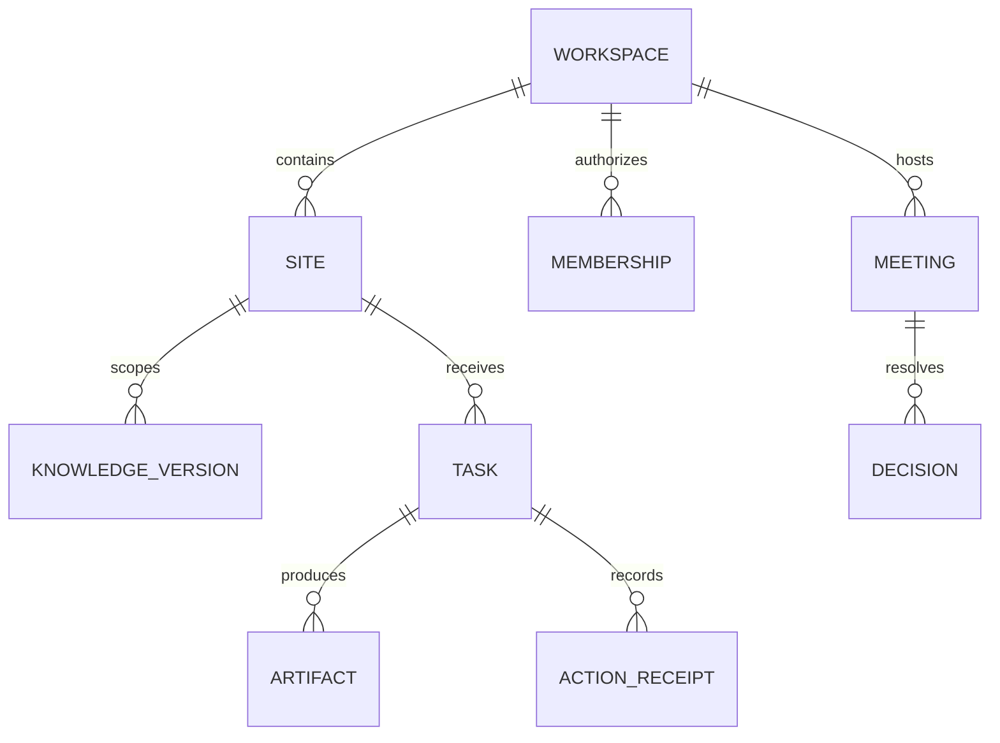

# Data, schema and memory

## External handoff discussion — 2026-10-10 PKT

Founder requests future ChatGPT-created images/documents sent through a Bizoveya plugin into a private inbox, assistant routing, specialist/QA tasks and permission-gated publication; also relevant-channel signals after verified blog/site updates. See [53 External handoff and change signals](53_EXTERNAL_HANDOFF_AND_CHANGE_SIGNALS.md). Intake is proposed as a durable service; broad knowledge is authorization-scoped. Receiving ChatGPT artifacts is separate from subscription inference. Connector transfer capability remains unqualified. Latest documentation needs no feature test; template MT152–155 remain pending. Next P04.3.4.3 can proceed with ownership/version design, but no new runtime/SQL/connector or publication is implemented by this planning checkpoint.

## 1.26 implemented source update

v2 document stores schema, existing brand/pins/slides plus templates {pins[2],carousel,linkedin} and linkedin {title,body}. Existing visual/revision tables store it without rewriting v1 rows. Histories parse both versions. No personal template definition, credential or asset store introduced. See [51](51_VISUAL_TEMPLATES_AND_LINKEDIN_IMAGE.md). Earlier dated contracts retain history.

## 2026-10-08 evolution update — planned direction

Future records: creator-owned template definition/version, authorized-use scope, artifact pinned template/source/brand versions, agent catalog and personal configuration, task/lease/event, meeting transcript/decision/update version/acknowledgement and follow-up tasks. Default personal templates stay private even in shared workspaces. Do not store secrets in prompts/events; approve knowledge/preferences separately. Retention, deletion dependencies and private export need explicit schema design before implementation.

See [50 Evolution record](50_EVOLUTION_TEMPLATES_AND_VISUAL_AGENCY.md) and [ADR-0017](decisions/ADR-0017-templates-and-event-driven-agency.md). Older dated contracts remain historical where superseded.

## Current checkpoint — 1.24 / P04.3.3.5

Explicit founder-owner draft dispatch is implemented on the separate admin deployment at `/admin/generations`, default off. Private campaign outputs now show Blog/Pinterest/LinkedIn text, citations, advisory QA and owner-only versioned human review. Additive037 follows036; no provider request, hosted SQL, publishing or Vercel setting change was made. See [44 Draft pilot and human review](44_DRAFT_PILOT_AND_HUMAN_REVIEW.md). This block supersedes older current-state blocks, which remain historical.

Founder reports the latest Gemini connectivity/three refreshed assignments/campaign readiness checks passed; screenshot independently confirms connectivity and Coordinator, and the prior video confirms Spending reload persistence. This is not whole-phase acceptance or proof of036 installation. New MT138–144 remain pending. P04.3.3 is IN PROGRESS; next is the explicitly activated one-run Gemini pilot and evidence review, not automatic advancement to visuals/publishing.

## Current checkpoint — 1.23 / P04.3.3.4

Server-only bounded draft engine is implemented with exact private request records, one attempt per Coordinator/Content/Quality role, approved-citation validation, durable output/usage settlement and no automatic retries. Additive036 revalidates execution dependencies and repairs connectivity admission to include campaign spending. No Generate route, activation, provider request, customer publication or hosted SQL was performed. See [43 Draft runtime and testing](43_DRAFT_RUNTIME_AND_TESTING.md). This block supersedes older current-state blocks below; those remain historical.

Founder reports034/035 applied; screenshots confirm three agentv2 approvals, Gemini assignments and prepared campaignv3 snapshot/3 stages/count1. Refresh persistence and all other unevidenced manual checks remain pending. Next is authorized dispatch, saved output review and explicit founder pilot activation within the same unfinished P04.3.3 phase.

## Current checkpoint — 1.20 / P04.3.3.1

Private campaign draft storage is implemented at `/workspaces/[workspaceId]/sites/[siteId]/campaigns`, with saved campaign URLs ending in `/[campaignId]`. This checkpoint stores manually authored brief/blog/Pinterest/LinkedIn text; it makes no model request and does not publish. Additive migration033 follows032. P04.3.3 remains in progress: bound-agent orchestration, generation reservations, durable execution/usage and output review are the next work on the SAME `phase/p04-3-3-durable-drafts` branch. See [40 Campaign drafts](40_CAMPAIGN_DRAFTS_AND_TESTING.md).

Founder screenshots on2026-10-03 confirm Gemini connectivity and MT107 settlement:20 input/7 output tokens, pricingv1, held/count amounts$0, run `e5be1ac3-5620-40e0-9498-97febb96fb15`. MT103 saved policy/history is evidenced; refresh persistence is not separately reported. Other unevidenced manual gates stay pending. Pakistan Token Factory onboarding is blocked; Builder application is under review. Nebius support email was drafted for the founder, not sent by the assistant. No main merge, production deployment, hosted SQL or provider call performed.

## Historical contract — 1.19 / P04.3.2

This update supersedes conflicting older “current” blocks below; historical records remain unchanged. Admin-only spending controls are at `/admin/spending` and `/api/admin/spending`. Migration032 follows031; never rerun applied migrations. New connectivity tests require reviewed USD pricing and enabled limits. The ledger reserves a conservative estimate before a provider call, settles reported usage, and holds uncertain/overrun charges until evidence-based reconciliation. Customer draft generation and publishing remain disabled. See [39 Spending controls](39_SPENDING_CONTROLS_AND_TESTING.md).

Founder reported all1.18 MT095–101 passed on2026-10-03; this is founder-reported local acceptance, not independent deployment verification. New MT102–109 remain pending. GitHub write access is restored; delivery uses `phase/p04-3-2-spending-controls`, not main. Main was inspected at1.7; this branch carries cumulative1.19 source. See38 and CONTINUATION for delivery state.

## Historical snapshot — 1.18 / P04.3.1

Reviewed model assignments are implemented at `/admin/bindings` and `/api/admin/bindings` on the separate admin host only. Migration 031 is additive after 030. An assignment pins a checked latest preview-approved agent version, matching-tier checked model profile, enabled credential-reference version and successful matching connectivity-test ID. Evidence must remain less than 24 hours old. Version changes, rotation, revocation or expiry require review; disable retains history. This is assignment configuration, not paid execution, budget enforcement or customer draft generation.

Use [37 Agent model assignments](37_AGENT_MODEL_ASSIGNMENTS.md) for setup and pending MT095–101. Next are P04.3.2 spending controls, P04.3.3 durable text drafts, and P04.3.4 visual composition. Publishing remains deferred. The founder's successful local Gemini test is accepted only for the evidenced case; all other unevidenced manual tests stay pending.

The founder approved one branch/PR per phase and six-hour continuation. GitHub reads succeeded but branch creation returned HTTP403 `Resource not accessible by integration`. No remote branch, commit or PR was created. The schedule was created then paused pending write access. See [38 Delivery and continuation](38_DELIVERY_AND_CONTINUATION.md). Earlier contracts below remain historical where superseded.

## Current contract — package1.17 / P04.0

P04.0 adds an admin-only model connectivity room at /admin/model-tests and /api/admin/model-tests. The saved provider/model uses the AI SDK with fixed OpenAI, Nebius Token Factory and Gemini adapters. It sends a fixed synthetic prompt, requests128 output tokens, waits20 seconds, makes no automatic retry/fallback, and stores redacted results with profile/reference versions, actor, reason and timestamps. No customer knowledge or prompt is sent. This is connectivity evidence, not quality evaluation, agent activation or a spending-budget implementation.

Live tests default off. Explicit operator setup requires the selected private provider key plus an admin-only SUPABASE_SERVICE_ROLE_KEY for server-attested result recording, then BIZOVEYA_ENABLE_MODEL_TESTS=true and per-request pricing/charge acknowledgement. No secret-entry form exists. Named current admin+AAL2 is required; client roles cannot mark results passed. Additive030 enforces one running test and five attempts per UTC day platform-wide, durable request IDs, expiry/unknown states and version-sensitive evidence. Failures/unknown attempts still consume the attempt allowance and may be billed. Existing dailyBudgetCents remains planning metadata; monetary enforcement precedes customer runtime.

Read36_MODEL_CONNECTIVITY_AND_TESTING.md for exact setup, supported evidence and MT087–094. All1.16 tests and earlier unevidenced founder gates stay pending; the founder is currently testing and has supplied no new pass results. Preserve001–029 and historical files. One cumulative ZIP/repository and the same two Vercel roots. No hosted SQL/deploy/provider request was performed by the assistant. Next implementation dependency: reviewed exact-model evidence, agent/profile binding, enforced monetary limits and durable draft runs, then visual output composition. The35 draft-only pilot and34 Studio/removal scope remain in force; publishing remains deferred.

Earlier release contracts below are historical and superseded where they conflict with this current contract.

## Historical contract — package1.16 / P02.5

The initial new-website audience is freelancers, consultants and small digital-service agencies. Existing sites remain niche-independent registrations. P02.5 repairs Studio and adds owner-only permanent site-record removal: collapsible workspace navigation (collapsed on Studio entry), bounded independently scrolling panels, whole-card section selection, canvas-local selected-section scrolling, homepage Hero/FAQ placement rules, explicit legacy order repair, 120-character headline/320-character hero introduction with counters, bounded responsive photo frames with fitting/focus, optional shared HTTPS logo, sample-fill with confirmation/Undo, section navigation/mobile menu and focused Professional Practice/Creative Business styling. Shared rendering serves preview and existing snapshot publication. No silent legacy row rewrite or automatic sample save/publish.

Additive029_business_studio_and_site_removal.sql preserves001–028. It accepts optional logo/photo metadata, keeps legacy read compatibility, enforces editorial rules on new saves/publication, and exposes owner-only version/name-confirmed bz_delete_site. Site removal cascades this site's business draft/public snapshots/history, knowledge/revisions/events and agent preferences, retaining a content-free owner-readable removal event. External hosting and original portfolio projects remain intact. This is permanent removal, not archiving/restoration. Old duplicate records are removed individually by their owner; no automatic merge.

The first agent pilot is now drafts only for doitwithai.tools: blog, Pinterest copy+rendered graphic, LinkedIn post and rendered carousel/PDF. This phase documents the pilot; live model execution and visual generation are not implemented here. Five proposed roles (coordinator, writer, QA, Pinterest, LinkedIn) share a future visual composer. Social OAuth and CMS writes are not prerequisites for draft generation. Model provider qualification/binding/enforced budget and stored runs remain prerequisites. Multipage/custom collections/listing-entry/navigation/media uploads/gallery/video blocks remain planned; current business sites still have one homepage with section navigation.34 contains current repairs/manual cases;35 contains pilot briefs and owner-reviewable starter knowledge.30 remains cumulative.

Founder reported all newly created Supabase files applied in the review; record this as founder-reported through028 setup, not independently verified database state. Studio/onboarding/deletion findings are open until owner retests1.16. Earlier unspecified acceptance/security gates remain pending. This is a living plan; subsequent founder instructions can revise it, with affected documents, code, migration, dependency and activity records updated together. One cumulative ZIP/repository, two existing Vercel app roots. No remote database/deployment/provider action performed.

Earlier sections remain historical; this current contract supersedes conflicts.

## Historical contract — package1.15 / P04.2.1

Private model_credentials (nonsecret flags/versions), model_profiles, immutable model_profile_versions, version-bound model_profile_checks and model_events. RLS enabled/direct privileges revoked; current admin RPC access only. Profile events keep actor/reason/time; stored actor may become null after Auth deletion. Key presence response is transient and never audited as a provider-health success.

P04.2.1 adds model-profile preparation and fixed credential references on the separate admin host. /admin/models saves immutable candidate versions and checks syntax/reference eligibility; /admin/credentials enables/disables or records rotation of the three fixed platform references. All reads/writes require current named admin+AAL2 in server and SQL. No key value is stored in the database or accepted by these forms/APIs. Keys are optional server-only BIZOVEYA_NEBIUS_API_KEY, BIZOVEYA_OPENAI_API_KEY or BIZOVEYA_GEMINI_API_KEY variables managed privately in deployment settings. Presence checks return only a boolean for the current admin deployment, providerValidated:false and runtimeEnabled:false. They do not authenticate providers or prove model availability.

No live calls, SDK runtime, secret-entry dashboard, actual provider revocation, model evaluation, profile-to-agent binding, fallback execution or enforced spend budget is implemented. Profiles remain candidates; tiers/token/budget values are future runtime metadata. Disabling a reference or recording rotation increments its version and invalidates prior dependent profile checks. Changing an environment variable alone is not detected as rotation; operator must redeploy and record it. Checks record current reference eligibility, not credential health. Admin scope remains separate from customer tenancy.

Additive028_model_profiles.sql preserves001–027 and historical data.32 profile definitions/100 versions each; latest30 versions and100 events displayed, older records retained. Same cumulative source repository and two Vercel projects. Optional provider variables belong on admin server for presence checks; a future runtime deployment must be configured independently. No key is needed to test missing-key states; no provider call/spend performed. See33 for exact workflow/new MT068–074;30 accumulates all pending steps. No founder test result was supplied by the continuation request, so all unevidenced acceptance remains pending.50 previous current MD plus33 and ADR-0012 makes52 current sources after rebuild.

Earlier sections retain history; this current contract supersedes conflicts.

## Historical contract — package1.14 / P04.1

Private tables agent_definitions, agent_versions, agent_checks, agent_changes; public but RLS-protected bizoveya_site_agent_preferences. Private version/event reads require current admin+AAL2 RPC. Site preference writes lock membership and site, increment version and compare expectedVersion. Context is transient; no preview transcript stored.

P04.1 implements agent configuration and readiness only. The separate admin host has /admin/agents: versioned drafts, schema/capability checks, human approval for context preview, review events, revocation and rollback to a previously checked version. Three migration-authored starter drafts (coordinator, content, quality) begin unchecked and unapproved. A saved edit creates a new immutable version; previous preview approval remains pinned until explicitly changed or revoked. Editing does not activate an agent. No live model execution, credential store, SDK runtime, external tools, provider calls or API spend is added.

Customer route /workspaces/[workspaceId]/sites/[siteId]/agents supports versioned site preferences and a current approved-knowledge context preview. Owner/editor write preferences; viewer reads. The backend checks membership/site binding, exact agent preview version and preferences version. Facts carry source/fact/revision citations. Platform instructions remain admin-only; platform admin alone cannot read customer knowledge. Client guidance and uploaded facts cannot grant permission. Preview is a snapshot, not a model answer; future execution must revalidate all approvals and versions.

Additive027_agent_configuration.sql retains001–026 and old project data. One shared @bizoveya/agent-contract workspace package defines typed role/capability/request contracts for both apps. The lockfile adds workspace links; third-party dependency versions stay unchanged. No new environment variable, model key, repository or deployment project. Upload packages/ along with both apps and rebuild both Vercel projects. See32 for exact setup, limits, routes and manual cases;30 combines all deferred actions. Founder has started testing but reported no results yet, so every unevidenced manual gate remains pending.

Earlier sections retain history and are superseded where they conflict with this current contract.

## Historical contract — package1.13 / P03.1

Three tables: bizoveya_knowledge_sources stores bounded current source/fact JSON and approval metadata; revisions retain immutable versions; events record action/actor/site/source/version/time without source content. Source deletion cascades revisions, retains a content-free delete event; site removal cascades all knowledge. No vector/cache/derived agent records exist yet. Provider backups and past exported copies are not erased by app deletion. Retention for backups/agent outputs must be decided before commercial launch.

P03.1 adds a private knowledge room to every registered site mode. Sources may be pasted or imported as UTF-8 .txt/.md, reviewed as editable fact candidates, saved with revisions, and explicitly approved by the workspace owner. Changes remove approval; retrieval is authenticated, current, approved-only and site-scoped. Editors draft; viewers read; only owners approve/revoke/delete. No model call, API key, embeddings, PDF/OCR, public chatbot or automatic website update is added. Additive026 supplies private sources/revisions/content-free activity events and membership-gated RPCs. See31 for behavior and30 for all pending manual/setup steps. All previously deferred founder tests remain pending.

Earlier sections retain historical delivery context and are superseded where they conflict with this current contract.

## Historical contract — package1.12 / P02.4

025 CREATE OR REPLACE preserves validator identity and old grants/check dependencies; only accepted preset IDs expand. No document rewrite/version increment. Old drafts/history/snapshots remain unchanged. New IDs require1.12-compatible public code; do not downgrade public app to1.11 after saving them without a reviewed compatibility plan. P02.4 adds Wellness Studio, Education Academy and Product Launch: six business families total. One catalog drives schema, template pages, creation and Studio; the shared section renderer also serves published snapshots. Additive025 expands accepted IDs without rewriting old data. Eight section types/nineteen layouts remain unchanged. No booking, checkout, LMS, enquiry inbox, custom domains or agents are added. See29 for template scope and30 for the combined pending setup/tests. Manual acceptance remains pending.

Older delivery sections retain history; this current contract supersedes conflicting capability/setup statements.

## Historical contract — package1.11 / P02.3.1

024 adds bizoveya_business_publications (current state) and bizoveya_business_publication_history (member-only action snapshots). Full approved snapshot stays private; anonymous RPC projects visible sections, strips unused About/services and unused image/item fields. Unpublish increments publication version and preserves draft/history. Foreign-key site deletion cascades records; no deletion UI is added. History is database-held, not model memory. Native business publishing now uses an explicit saved snapshot and `/sites/[siteId]` visitor route. Saves remain private; publishing/republishing/unpublishing use membership checks, draft/publication version conflicts, and additive024. Hidden sections are removed from anonymous payloads; full snapshot history stays member-only. Owner/editor can publish; viewer cannot. Custom domains, enquiry-form delivery and AI agents remain planned. See28 for setup/manual acceptance and ADR-0008 for architecture. Admin app and inherited portfolio remain unchanged.

Earlier release sections retain history and are superseded where they conflict with this current contract.

## Historical contract — package1.10 / P02.2.Fix-1

Additive023 introduces normalized identity helper functions, lookup indexes, a BEFORE INSERT/UPDATE site trigger, the atomic business-registration RPC, and create/rename workspace duplicate guards. No old row/document/version is rewritten. Legacy duplicates are preserved and flagged in site cards; operator read-only report023 enumerates records for reviewed reconciliation. New business drafts start at version1; existing drafts retain their versions and JSON. Site registry labels and website brand names are explicitly distinct.

Earlier release sections retain history; this current contract supersedes conflicting behavior descriptions.

## Historical contract — package1.9 / P02.2

BusinessDocument schemaVersion2 adds `font`, `hours`, `sections` to retained v1 facts; templateId accepts three approved IDs. Every section has `{id,type,layout,visible,tone,heading,body,image,items}`; every item has `{title,body,image}`. Hero/about/services/contact bind shared facts. Other section items store approved quote/project/FAQ content. Duplicate shared-fact sections intentionally share the facts; their layout/local headings remain independent.

Limits: 20 sections, 8 local items per section, 1–6 shared services, bounded strings and 60,000 UTF-8 JSON bytes in app; API body 65,536 bytes; SQL JSON text cap65,536. Legacy v1 remains accepted by SQL for old clients. Application reads upgrade in memory and the next explicit save persists v2 using the original concurrency version. 022 rewrites no row or version. Only latest draft is durable; 30-edit undo/redo is session memory, not stored revisions. JSON restore is unsaved until explicit Save. Upload/media library and server-side asset storage remain future work.

Earlier dated sections below retain history; this current contract supersedes conflicting instructions.

## Historical contract — package1.8 / P02.1

Migration021 adds `public.bizoveya_business_drafts`: site_id PK/FK, strict document JSONB, positive version, updated_by and updated_at. FK deletion follows the registered site. Only native_business mode can save. Existing project/publication/admin tables are untouched. The table stores one latest private draft, not historical versions or agent memory. No anonymous reads; membership RLS. Demo edits stay in memory in the browser tab, with no draft data stored in localStorage; only theme choice is persisted. Backup download is user-controlled.

Earlier sections below retain planning/delivery history; conflicting capability or path descriptions are superseded by this current contract and document25.

**Draft 0.1.** Existing SQL files in `supabase/migrations/001_projects.sql` through `017_vox_interview_demo_sessions.sql` are **Verified in code**; which ran in production is unknown. Do not edit old applied migrations. Use additive numbered migrations after checking remote state and policy behavior.

## Proposed ownership model

`workspace_id` is the tenant boundary. A site has `site_type` (native portfolio/native business/connected/read-only), source URL, connection state and capabilities; do not treat a connected URL as ownership proof. Native projects may initially link through a mapping table to avoid breaking existing `project_id` FKs. Define explicit relationship/claim migration and backfill with dry-run evidence. Separate connector credentials from user documents and never place them in agent memory.

Knowledge object: site scope, visibility (`public-approved`, `private-operational`), original document reference, extraction version, proposed fact, owner approval, supersession, citation, retention/delete status. Retrieval filters by tenant, site and visibility before ranking. Personal agent conversation and shared business knowledge are distinct; a meeting decision becomes actionable only when owner-authorized. Site-level memory must not silently bleed across Do It With AI Tools, Sufian Mustafa and LIONXE. Search/indexing may be introduced later with an ADR and negative tests.

Task/event objects: immutable event ID, task ID, actor, typed action, state, input artifact/version, output pointer, request idempotency key, provider/model metadata, token/cost counters, checkpoint and correlation ID. External receipts store remote object/revision, timestamp and result. Meeting transcript turns link speaker identity and source; decision links approved action items. Lead data gets consent/purpose, visibility and deletion path.

## Migration and retention process

Inventory actual tables, policies, indexes and current migration history before writing migration 018. Export a sanitized schema and test both fresh setup and upgrade from a realistic V27.12 fixture; test rollback/forward repair. RLS must deny cross-workspace and public-to-private access. Service-role use is server-only and audited. Define retention windows and data export/erasure after owner and jurisdiction review; until then avoid indefinite raw call audio/transcripts and arbitrary document uploads. Backups, restore drills and encryption/key rotation require operational proof, not a statement in a spec.

## Proposed administration/configuration entities (package 1.2)

These are logical schema candidates, not created tables or migrations. Final schema follows live migration audit.

| Entity | Main fields / boundary |
|---|---|
| Platform role grant | Named user, granted role/scope, issuer, expiry/revocation, audit; not user-editable profile data |
| Agent definition/version | Role, instruction text, supported schema/tool identifiers, model profile, version state, author/reason/test evidence |
| Active config pointer | Environment/scope, selected immutable version, activation actor/time, optimistic revision |
| Workspace/site agent preferences | Tenant/site scope, brand/audience, approved knowledge refs, bounded overrides and version |
| Model profile/catalog | Provider/model ID, capabilities, eligibility review, limits, fallback profile and test evidence |
| Credential metadata | Provider/environment or workspace/site, secret-store reference/version, health, owner, expiry; no plaintext secret |
| Run snapshot | Agent config, client preference/knowledge versions, model profile and credential reference versions, requester, scope, budget |
| Evaluation case/result | Sanitized input, expected behavior/validators, config/model versions, observed failures, reviewer, cost |
| Admin audit event | Actor/time/reason, target/scope, redacted change/version refs, authorization outcome |
| Template version | Approved component/schema IDs, metadata/content/preview, draft/active status and author |
| Presence event (optional) | Tenant/user, heartbeat and expiry; explicit retention, not permanent login history |

Platform data must be separated from tenant documents and connectors by authorized access policies. Service-role operations require explicit application authorization. Support access records reason, scope, expiry and actor. Pin snapshots for reproducibility; redact secrets from all audit diffs and exports. Define retention of config/run/evaluation/audit data and deletion treatment before customer launch; do not fabricate numeric policies. Public docs contain conceptual schemas only.

## Package 1.3 transition and impact synchronization

Before workspace migrations, reconcile applied SQL and define explicit native-project/workspace mappings without changing ownership silently. Template/config versions and artifact approvals pin their referenced revision; knowledge changes/deletion propagate to derived retrieval records. Proposed event envelopes/outbox behavior in document 19 are logical contracts, not implemented tables. Preserve old records and test fresh/upgrade paths before activation.

## Package 1.4 — first practical workspace implementation

Migration `018_bizoveya_workspaces.sql` is additive to the source series 001–017; **remote applied state is unknown**. New tables: `bizoveya_workspaces` (creator owner, name, version/timestamps), `bizoveya_memberships` (workspace/user role), `bizoveya_sites` (mode/category/public URL or project link, registry status/version, declaration time/actor). Owner/editor can mutate site records; viewer reads metadata; only owner renames workspace. Creator receives owner role atomically. Invites/role administration are not implemented.

Existing `projects` ownership/RLS/documents/publication IDs remain unchanged. A project can be linked once across site records, only by its original owner; linking never delegates Studio permissions. Deleting that project sets the registry FK to null and labels the source unavailable, preserving legacy deletion. Site mode/category/project association are immutable through the update API. Name/status and an external URL may be updated with expected version; URL changes require renewed attestation. Status is registry metadata only. No data backfill or registration of the founder's sites is performed automatically.

New DB tables grant authenticated SELECT only; anon and direct writes are revoked. Mutations use explicitly granted RPCs with fixed empty search paths, schema-qualified relations, membership checks/locks and caller `auth.uid()`. Staging acceptance SQL includes two-site isolation, roles/revocation, direct-write/anonymous denials, duplicate link/stale version, and old-project deletion behavior; it has not been run against a real database.

## Package 1.5 — private admin data

Migration `019_bizoveya_admin_identity.sql` adds private `platform_admins(user_id,granted_at)` and `admin_audit(id,occurred_at,action,subject_id,operator_label,database_actor,reason)`. The grant references the Auth user with deletion cascade; the audit retains subject UUID independently so user deletion does not erase history. App roles receive no direct table privileges and no write RPC. Role insertion/deletion emits an audit event through a DB trigger; a privileged database operator remains trusted.

`bz_admin_identity()` exposes only the caller's eligibility/AAL status. `bz_admin_summary()` returns four aggregate counts; `bz_admin_audit()` returns the newest 100 grant/revoke events. Both require current admin+AAL2. `bizoveya_private.set_platform_admin(...)` is operator-only; the supplied template is not a migration and must not be embedded in public client code. Repeated identical state is a no-op. Remote migration state and SQL assertion results remain unknown. No client knowledge/memory/retention policy is altered.

## Package1.6 — migration020 and executed SQL evidence

`020_bizoveya_admin_recovery.sql` additively replaces the private operator function from019. New grants require an existing non-deleted Auth account; revocation no longer requires account eligibility. Missing/repeated revocations are no-ops, while actual deletions retain the existing atomic audit trigger. Migrations001–019 remain byte-preserved. No new table, backfill or real account mutation occurs.

The isolated SQL harness applies001–020 against local compatibility fixtures, executes018/019/020 assertions and checks preservation of seeded project/workspace/site/grant/audit data across upgrade boundaries. This is executed PostgreSQL-WASM evidence with simulated JWT settings, not proof of a real Supabase environment or concurrency. See document22 for reproducibility and limitations.

## Package1.7 — separate admin application (current contract)

This section supersedes earlier same-host admin/source-path instructions for the current package, while preserving those earlier delivery records. Under ADR-0004, public code is apps/web/src; admin code is apps/admin/src. Source folders are not URL prefixes. The main host has no /admin or /api/admin pages/handlers, no admin button or redirect. Admin-only paths belong to the separate host; / redirects to its /login, with approved-role/MFA checks for protected pages/APIs. Admin has no customer/docs/marketing routes. All canonical Markdown remains at root docs/platform and is visualized only by the main app. Both deploy independently from one repository/ZIP; shared Supabase/migrations remain centrally managed. See23 for founder-reported testing,24 for explicit install/deploy/environment/manual instructions, and ADR-0004 for the decision. No new migration or live domain configuration is delivered. Real admin Auth/MFA, tenant isolation and production acceptance remain pending. Current source paths elsewhere in prior historical sections must be interpreted through this ownership map.
