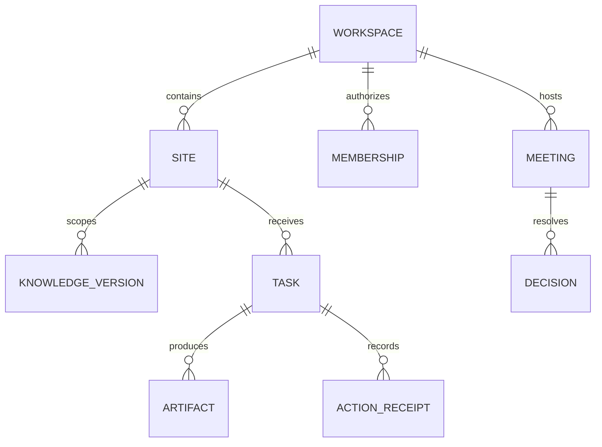

# Data, schema and memory

**Current package1.7:** public/admin host ownership has changed. Read the Package1.7 section below and document24 before applying older setup instructions.

**Draft 0.1.** Existing SQL files in `supabase/migrations/001_projects.sql` through `017_vox_interview_demo_sessions.sql` are **Verified in code**; which ran in production is unknown. Do not edit old applied migrations. Use additive numbered migrations after checking remote state and policy behavior.

## Proposed ownership model

`workspace_id` is the tenant boundary. A site has `site_type` (native portfolio/native business/connected/read-only), source URL, connection state and capabilities; do not treat a connected URL as ownership proof. Native projects may initially link through a mapping table to avoid breaking existing `project_id` FKs. Define explicit relationship/claim migration and backfill with dry-run evidence. Separate connector credentials from user documents and never place them in agent memory.

Knowledge object: site scope, visibility (`public-approved`, `private-operational`), original document reference, extraction version, proposed fact, owner approval, supersession, citation, retention/delete status. Retrieval filters by tenant, site and visibility before ranking. Personal agent conversation and shared business knowledge are distinct; a meeting decision becomes actionable only when owner-authorized. Site-level memory must not silently bleed across Do It With AI Tools, Sufian Mustafa and LIONXE. Search/indexing may be introduced later with an ADR and negative tests.

Task/event objects: immutable event ID, task ID, actor, typed action, state, input artifact/version, output pointer, request idempotency key, provider/model metadata, token/cost counters, checkpoint and correlation ID. External receipts store remote object/revision, timestamp and result. Meeting transcript turns link speaker identity and source; decision links approved action items. Lead data gets consent/purpose, visibility and deletion path.

## Migration and retention process

Inventory actual tables, policies, indexes and current migration history before writing migration 018. Export a sanitized schema and test both fresh setup and upgrade from a realistic V27.12 fixture; test rollback/forward repair. RLS must deny cross-workspace and public-to-private access. Service-role use is server-only and audited. Define retention windows and data export/erasure after owner and jurisdiction review; until then avoid indefinite raw call audio/transcripts and arbitrary document uploads. Backups, restore drills and encryption/key rotation require operational proof, not a statement in a spec.

## Proposed administration/configuration entities (package 1.2)

These are logical schema candidates, not created tables or migrations. Final schema follows live migration audit.

| Entity | Main fields / boundary |
|---|---|
| Platform role grant | Named user, granted role/scope, issuer, expiry/revocation, audit; not user-editable profile data |
| Agent definition/version | Role, instruction text, supported schema/tool identifiers, model profile, version state, author/reason/test evidence |
| Active config pointer | Environment/scope, selected immutable version, activation actor/time, optimistic revision |
| Workspace/site agent preferences | Tenant/site scope, brand/audience, approved knowledge refs, bounded overrides and version |
| Model profile/catalog | Provider/model ID, capabilities, eligibility review, limits, fallback profile and test evidence |
| Credential metadata | Provider/environment or workspace/site, secret-store reference/version, health, owner, expiry; no plaintext secret |
| Run snapshot | Agent config, client preference/knowledge versions, model profile and credential reference versions, requester, scope, budget |
| Evaluation case/result | Sanitized input, expected behavior/validators, config/model versions, observed failures, reviewer, cost |
| Admin audit event | Actor/time/reason, target/scope, redacted change/version refs, authorization outcome |
| Template version | Approved component/schema IDs, metadata/content/preview, draft/active status and author |
| Presence event (optional) | Tenant/user, heartbeat and expiry; explicit retention, not permanent login history |

Platform data must be separated from tenant documents and connectors by authorized access policies. Service-role operations require explicit application authorization. Support access records reason, scope, expiry and actor. Pin snapshots for reproducibility; redact secrets from all audit diffs and exports. Define retention of config/run/evaluation/audit data and deletion treatment before customer launch; do not fabricate numeric policies. Public docs contain conceptual schemas only.

## Package 1.3 transition and impact synchronization

Before workspace migrations, reconcile applied SQL and define explicit native-project/workspace mappings without changing ownership silently. Template/config versions and artifact approvals pin their referenced revision; knowledge changes/deletion propagate to derived retrieval records. Proposed event envelopes/outbox behavior in document 19 are logical contracts, not implemented tables. Preserve old records and test fresh/upgrade paths before activation.

## Package 1.4 — first practical workspace implementation

Migration `018_bizoveya_workspaces.sql` is additive to the source series 001–017; **remote applied state is unknown**. New tables: `bizoveya_workspaces` (creator owner, name, version/timestamps), `bizoveya_memberships` (workspace/user role), `bizoveya_sites` (mode/category/public URL or project link, registry status/version, declaration time/actor). Owner/editor can mutate site records; viewer reads metadata; only owner renames workspace. Creator receives owner role atomically. Invites/role administration are not implemented.

Existing `projects` ownership/RLS/documents/publication IDs remain unchanged. A project can be linked once across site records, only by its original owner; linking never delegates Studio permissions. Deleting that project sets the registry FK to null and labels the source unavailable, preserving legacy deletion. Site mode/category/project association are immutable through the update API. Name/status and an external URL may be updated with expected version; URL changes require renewed attestation. Status is registry metadata only. No data backfill or registration of the founder's sites is performed automatically.

New DB tables grant authenticated SELECT only; anon and direct writes are revoked. Mutations use explicitly granted RPCs with fixed empty search paths, schema-qualified relations, membership checks/locks and caller `auth.uid()`. Staging acceptance SQL includes two-site isolation, roles/revocation, direct-write/anonymous denials, duplicate link/stale version, and old-project deletion behavior; it has not been run against a real database.

## Package 1.5 — private admin data

Migration `019_bizoveya_admin_identity.sql` adds private `platform_admins(user_id,granted_at)` and `admin_audit(id,occurred_at,action,subject_id,operator_label,database_actor,reason)`. The grant references the Auth user with deletion cascade; the audit retains subject UUID independently so user deletion does not erase history. App roles receive no direct table privileges and no write RPC. Role insertion/deletion emits an audit event through a DB trigger; a privileged database operator remains trusted.

`bz_admin_identity()` exposes only the caller's eligibility/AAL status. `bz_admin_summary()` returns four aggregate counts; `bz_admin_audit()` returns the newest 100 grant/revoke events. Both require current admin+AAL2. `bizoveya_private.set_platform_admin(...)` is operator-only; the supplied template is not a migration and must not be embedded in public client code. Repeated identical state is a no-op. Remote migration state and SQL assertion results remain unknown. No client knowledge/memory/retention policy is altered.

## Package1.6 — migration020 and executed SQL evidence

`020_bizoveya_admin_recovery.sql` additively replaces the private operator function from019. New grants require an existing non-deleted Auth account; revocation no longer requires account eligibility. Missing/repeated revocations are no-ops, while actual deletions retain the existing atomic audit trigger. Migrations001–019 remain byte-preserved. No new table, backfill or real account mutation occurs.

The isolated SQL harness applies001–020 against local compatibility fixtures, executes018/019/020 assertions and checks preservation of seeded project/workspace/site/grant/audit data across upgrade boundaries. This is executed PostgreSQL-WASM evidence with simulated JWT settings, not proof of a real Supabase environment or concurrency. See document22 for reproducibility and limitations.

## Package1.7 — separate admin application (current contract)

This section supersedes earlier same-host admin/source-path instructions for the current package, while preserving those earlier delivery records. Under ADR-0004, public code is apps/web/src; admin code is apps/admin/src. Source folders are not URL prefixes. The main host has no /admin or /api/admin pages/handlers, no admin button or redirect. Admin-only paths belong to the separate host; / redirects to its /login, with approved-role/MFA checks for protected pages/APIs. Admin has no customer/docs/marketing routes. All canonical Markdown remains at root docs/platform and is visualized only by the main app. Both deploy independently from one repository/ZIP; shared Supabase/migrations remain centrally managed. See23 for founder-reported testing,24 for explicit install/deploy/environment/manual instructions, and ADR-0004 for the decision. No new migration or live domain configuration is delivered. Real admin Auth/MFA, tenant isolation and production acceptance remain pending. Current source paths elsewhere in prior historical sections must be interpreted through this ownership map.
