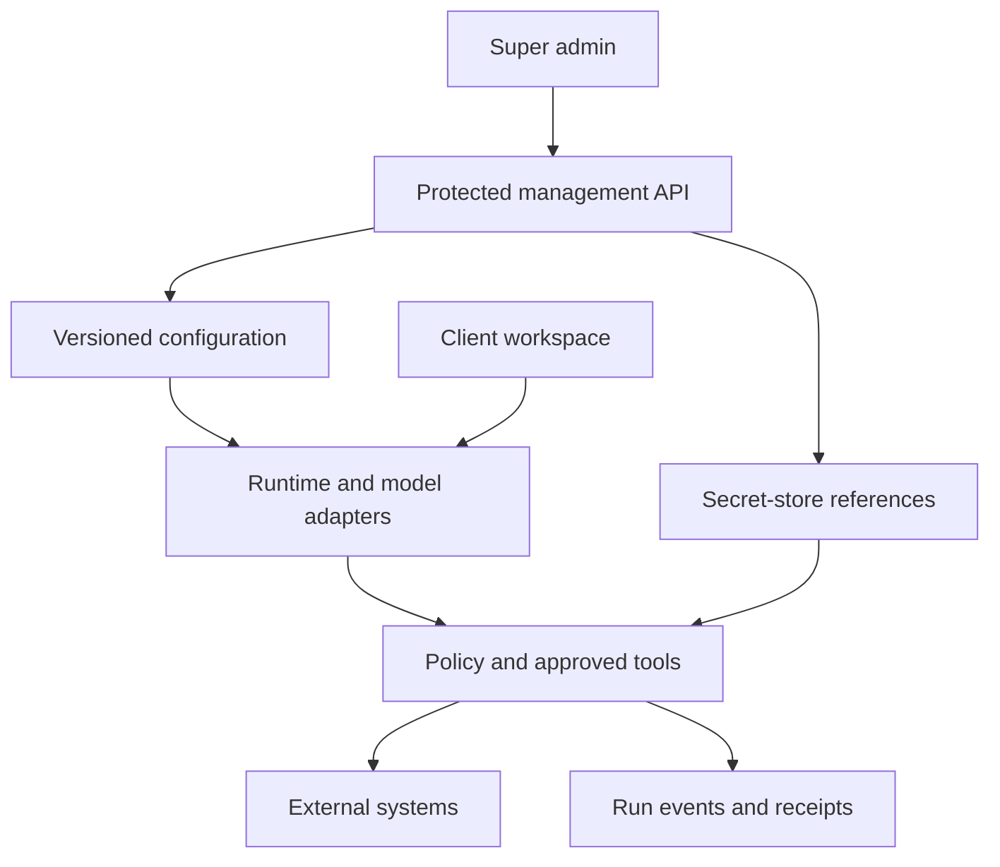
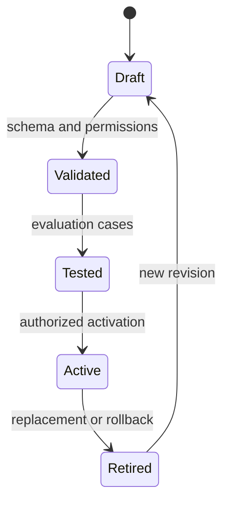

# Backend and super admin control contract

## Current checkpoint — 1.20 / P04.3.3.1

Private campaign draft storage is implemented at `/workspaces/[workspaceId]/sites/[siteId]/campaigns`, with saved campaign URLs ending in `/[campaignId]`. This checkpoint stores manually authored brief/blog/Pinterest/LinkedIn text; it makes no model request and does not publish. Additive migration033 follows032. P04.3.3 remains in progress: bound-agent orchestration, generation reservations, durable execution/usage and output review are the next work on the SAME `phase/p04-3-3-durable-drafts` branch. See [40 Campaign drafts](40_CAMPAIGN_DRAFTS_AND_TESTING.md).

Founder screenshots on2026-10-03 confirm Gemini connectivity and MT107 settlement:20 input/7 output tokens, pricingv1, held/count amounts$0, run `e5be1ac3-5620-40e0-9498-97febb96fb15`. MT103 saved policy/history is evidenced; refresh persistence is not separately reported. Other unevidenced manual gates stay pending. Pakistan Token Factory onboarding is blocked; Builder application is under review. Nebius support email was drafted for the founder, not sent by the assistant. No main merge, production deployment, hosted SQL or provider call performed.

## Historical contract — 1.19 / P04.3.2

This update supersedes conflicting older “current” blocks below; historical records remain unchanged. Admin-only spending controls are at `/admin/spending` and `/api/admin/spending`. Migration032 follows031; never rerun applied migrations. New connectivity tests require reviewed USD pricing and enabled limits. The ledger reserves a conservative estimate before a provider call, settles reported usage, and holds uncertain/overrun charges until evidence-based reconciliation. Customer draft generation and publishing remain disabled. See [39 Spending controls](39_SPENDING_CONTROLS_AND_TESTING.md).

Founder reported all1.18 MT095–101 passed on2026-10-03; this is founder-reported local acceptance, not independent deployment verification. New MT102–109 remain pending. GitHub write access is restored; delivery uses `phase/p04-3-2-spending-controls`, not main. Main was inspected at1.7; this branch carries cumulative1.19 source. See38 and CONTINUATION for delivery state.

## Historical snapshot — 1.18 / P04.3.1

Reviewed model assignments are implemented at `/admin/bindings` and `/api/admin/bindings` on the separate admin host only. Migration 031 is additive after 030. An assignment pins a checked latest preview-approved agent version, matching-tier checked model profile, enabled credential-reference version and successful matching connectivity-test ID. Evidence must remain less than 24 hours old. Version changes, rotation, revocation or expiry require review; disable retains history. This is assignment configuration, not paid execution, budget enforcement or customer draft generation.

Use [37 Agent model assignments](37_AGENT_MODEL_ASSIGNMENTS.md) for setup and pending MT095–101. Next are P04.3.2 spending controls, P04.3.3 durable text drafts, and P04.3.4 visual composition. Publishing remains deferred. The founder's successful local Gemini test is accepted only for the evidenced case; all other unevidenced manual tests stay pending.

The founder approved one branch/PR per phase and six-hour continuation. GitHub reads succeeded but branch creation returned HTTP403 `Resource not accessible by integration`. No remote branch, commit or PR was created. The schedule was created then paused pending write access. See [38 Delivery and continuation](38_DELIVERY_AND_CONTINUATION.md). Earlier contracts below remain historical where superseded.

## Current contract — package1.17 / P04.0

P04.0 adds an admin-only model connectivity room at /admin/model-tests and /api/admin/model-tests. The saved provider/model uses the AI SDK with fixed OpenAI, Nebius Token Factory and Gemini adapters. It sends a fixed synthetic prompt, requests128 output tokens, waits20 seconds, makes no automatic retry/fallback, and stores redacted results with profile/reference versions, actor, reason and timestamps. No customer knowledge or prompt is sent. This is connectivity evidence, not quality evaluation, agent activation or a spending-budget implementation.

Live tests default off. Explicit operator setup requires the selected private provider key plus an admin-only SUPABASE_SERVICE_ROLE_KEY for server-attested result recording, then BIZOVEYA_ENABLE_MODEL_TESTS=true and per-request pricing/charge acknowledgement. No secret-entry form exists. Named current admin+AAL2 is required; client roles cannot mark results passed. Additive030 enforces one running test and five attempts per UTC day platform-wide, durable request IDs, expiry/unknown states and version-sensitive evidence. Failures/unknown attempts still consume the attempt allowance and may be billed. Existing dailyBudgetCents remains planning metadata; monetary enforcement precedes customer runtime.

Read36_MODEL_CONNECTIVITY_AND_TESTING.md for exact setup, supported evidence and MT087–094. All1.16 tests and earlier unevidenced founder gates stay pending; the founder is currently testing and has supplied no new pass results. Preserve001–029 and historical files. One cumulative ZIP/repository and the same two Vercel roots. No hosted SQL/deploy/provider request was performed by the assistant. Next implementation dependency: reviewed exact-model evidence, agent/profile binding, enforced monetary limits and durable draft runs, then visual output composition. The35 draft-only pilot and34 Studio/removal scope remain in force; publishing remains deferred.

Earlier release contracts below are historical and superseded where they conflict with this current contract.

## Historical contract — package1.16 / P02.5

The initial new-website audience is freelancers, consultants and small digital-service agencies. Existing sites remain niche-independent registrations. P02.5 repairs Studio and adds owner-only permanent site-record removal: collapsible workspace navigation (collapsed on Studio entry), bounded independently scrolling panels, whole-card section selection, canvas-local selected-section scrolling, homepage Hero/FAQ placement rules, explicit legacy order repair, 120-character headline/320-character hero introduction with counters, bounded responsive photo frames with fitting/focus, optional shared HTTPS logo, sample-fill with confirmation/Undo, section navigation/mobile menu and focused Professional Practice/Creative Business styling. Shared rendering serves preview and existing snapshot publication. No silent legacy row rewrite or automatic sample save/publish.

Additive029_business_studio_and_site_removal.sql preserves001–028. It accepts optional logo/photo metadata, keeps legacy read compatibility, enforces editorial rules on new saves/publication, and exposes owner-only version/name-confirmed bz_delete_site. Site removal cascades this site's business draft/public snapshots/history, knowledge/revisions/events and agent preferences, retaining a content-free owner-readable removal event. External hosting and original portfolio projects remain intact. This is permanent removal, not archiving/restoration. Old duplicate records are removed individually by their owner; no automatic merge.

The first agent pilot is now drafts only for doitwithai.tools: blog, Pinterest copy+rendered graphic, LinkedIn post and rendered carousel/PDF. This phase documents the pilot; live model execution and visual generation are not implemented here. Five proposed roles (coordinator, writer, QA, Pinterest, LinkedIn) share a future visual composer. Social OAuth and CMS writes are not prerequisites for draft generation. Model provider qualification/binding/enforced budget and stored runs remain prerequisites. Multipage/custom collections/listing-entry/navigation/media uploads/gallery/video blocks remain planned; current business sites still have one homepage with section navigation.34 contains current repairs/manual cases;35 contains pilot briefs and owner-reviewable starter knowledge.30 remains cumulative.

Founder reported all newly created Supabase files applied in the review; record this as founder-reported through028 setup, not independently verified database state. Studio/onboarding/deletion findings are open until owner retests1.16. Earlier unspecified acceptance/security gates remain pending. This is a living plan; subsequent founder instructions can revise it, with affected documents, code, migration, dependency and activity records updated together. One cumulative ZIP/repository, two existing Vercel app roots. No remote database/deployment/provider action performed.

Earlier sections remain historical; this current contract supersedes conflicts.

## Historical contract — package1.15 / P04.2.1

Now has model/credential-reference control pages in addition to agent defaults. Candidate metadata and event history are editable under current admin+AAL2; key values remain deployment-environment secrets. No secret-entry field, encrypted DB vault, live credential health test, fresh reauth flow, profile/agent activation, model worker or actual provider revoke is delivered.

P04.2.1 adds model-profile preparation and fixed credential references on the separate admin host. /admin/models saves immutable candidate versions and checks syntax/reference eligibility; /admin/credentials enables/disables or records rotation of the three fixed platform references. All reads/writes require current named admin+AAL2 in server and SQL. No key value is stored in the database or accepted by these forms/APIs. Keys are optional server-only BIZOVEYA_NEBIUS_API_KEY, BIZOVEYA_OPENAI_API_KEY or BIZOVEYA_GEMINI_API_KEY variables managed privately in deployment settings. Presence checks return only a boolean for the current admin deployment, providerValidated:false and runtimeEnabled:false. They do not authenticate providers or prove model availability.

No live calls, SDK runtime, secret-entry dashboard, actual provider revocation, model evaluation, profile-to-agent binding, fallback execution or enforced spend budget is implemented. Profiles remain candidates; tiers/token/budget values are future runtime metadata. Disabling a reference or recording rotation increments its version and invalidates prior dependent profile checks. Changing an environment variable alone is not detected as rotation; operator must redeploy and record it. Checks record current reference eligibility, not credential health. Admin scope remains separate from customer tenancy.

Additive028_model_profiles.sql preserves001–027 and historical data.32 profile definitions/100 versions each; latest30 versions and100 events displayed, older records retained. Same cumulative source repository and two Vercel projects. Optional provider variables belong on admin server for presence checks; a future runtime deployment must be configured independently. No key is needed to test missing-key states; no provider call/spend performed. See33 for exact workflow/new MT068–074;30 accumulates all pending steps. No founder test result was supplied by the continuation request, so all unevidenced acceptance remains pending.50 previous current MD plus33 and ADR-0012 makes52 current sources after rebuild.

Earlier sections retain history; this current contract supersedes conflicts.

## Historical contract — package1.14 / P04.1

Admin controls now include agent registry/forms/checks/preview review/history/rollback/revoke. Model profile/API key room still planned, not enabled. Public app does not expose admin UI/API routes. Three seeded drafts are not running agents. Admin lacks customer knowledge access by default; customer prefers site behavior only.

P04.1 implements agent configuration and readiness only. The separate admin host has /admin/agents: versioned drafts, schema/capability checks, human approval for context preview, review events, revocation and rollback to a previously checked version. Three migration-authored starter drafts (coordinator, content, quality) begin unchecked and unapproved. A saved edit creates a new immutable version; previous preview approval remains pinned until explicitly changed or revoked. Editing does not activate an agent. No live model execution, credential store, SDK runtime, external tools, provider calls or API spend is added.

Customer route /workspaces/[workspaceId]/sites/[siteId]/agents supports versioned site preferences and a current approved-knowledge context preview. Owner/editor write preferences; viewer reads. The backend checks membership/site binding, exact agent preview version and preferences version. Facts carry source/fact/revision citations. Platform instructions remain admin-only; platform admin alone cannot read customer knowledge. Client guidance and uploaded facts cannot grant permission. Preview is a snapshot, not a model answer; future execution must revalidate all approvals and versions.

Additive027_agent_configuration.sql retains001–026 and old project data. One shared @bizoveya/agent-contract workspace package defines typed role/capability/request contracts for both apps. The lockfile adds workspace links; third-party dependency versions stay unchanged. No new environment variable, model key, repository or deployment project. Upload packages/ along with both apps and rebuild both Vercel projects. See32 for exact setup, limits, routes and manual cases;30 combines all deferred actions. Founder has started testing but reported no results yet, so every unevidenced manual gate remains pending.

Earlier sections retain history and are superseded where they conflict with this current contract.

## Historical contract — package1.9 / P02.2

P02.2 does not add admin template editing, API-key rooms, new admin writes or agents. Business catalogue/renderer remains code-defined and validated. Future super-admin metadata/preset management must use approved section capabilities and schema versions; arbitrary JSX/executable layouts still require code review. Admin app remains separately deployed; public host has no admin route/link. SQL022 changes business draft validation only.

Earlier dated sections below retain history; this current contract supersedes conflicting instructions.

## Historical contract — package1.8 / P02.1

P02.1 adds shared database storage and main-app authenticated business draft API. It does not add super-admin template CRUD or credential forms. Business owners/editors use workspace roles; platform-admin role is a separate boundary and does not bypass draft membership. The separate admin app remains readonly overview/audit/MFA; approved layout/template administration remains planned.

Earlier sections below retain planning/delivery history; conflicting capability or path descriptions are superseded by this current contract and document25.

**Current package 1.5: identity/MFA/read-only shell is implemented in source; config/credentials/runtime management remains planned. Original package 1.2 planning contract follows.** Owner-directed extension arising from [the recorded discussion](17_DISCUSSION_AND_DECISION_RECORD.md) and [ADR-0002](decisions/ADR-0002-configurable-agents-and-admin-control.md). Bizoveya already inherits server APIs and Supabase; this is an extension of that backend with a management layer, not the first backend or a replacement of the existing portfolio app.

## Configuration versus executable capabilities

Store supported settings as versioned data. The dashboard submits validated configuration to authenticated server APIs. Workers load an immutable configuration snapshot for each run and invoke the selected runtime/model/tools. Administrators do not edit arbitrary source code or execute arbitrary scripts through a settings form. SDK libraries are implementation dependencies; an AI agent is a configured role using them, not an imported ChatGPT session.

| Dashboard editable | Backend enforced | Requires software release |
|---|---|---|
| Agent name, role instructions, output schema selection from approved registry | Actor authorization, tenant isolation, tool allowlist enforcement | New tools, integrations, arbitrary output schema support |
| Model/profile selection from approved catalog, budgets and fallback order | Eligibility, compatibility, spend ceilings, bounded retries | New provider adapter or unsupported capability |
| QA checklists, approved facts requirements, test fixtures and review thresholds | URL/field/schema validation and action authorization | New validator implementation |
| Template content, categories, metadata and supported block arrangement | Allowed schema/components, content sanitation and preview boundary | New rendering components or layout engine |
| Workspace status, quotas, supported feature switches | Permission checks, revocation and action reconciliation | Auth/role architecture changes |

## Instruction hierarchy and conflict handling

1. Backend-enforced access and action controls apply regardless of model output or prompt text.
2. Platform/agent defaults are authored by authorized platform staff and versioned.
3. Workspace/site preferences express client brand, audience, approved sources and bounded scheduling settings.
4. Task instructions refine the current request within the above permission boundary.
5. Documents, websites and messages are evidence/data, not an authority to redefine tool permissions.

A client can request an additional review but cannot authorize access to another tenant, expand an agent's platform permissions, or bypass a mandatory action gate. Show a conflict rather than silently discarding a client request. Platform policy changes outside supported configuration still require a reviewed software release.

## Super admin modules and proposed routes

The table records original route proposals. Current package 1.5 implements only `/admin`, `/admin/audit` and the added `/admin/security`. Other entries remain proposed; exact source states are in document 20. All admin data is outside the public `/bizoveya/docs` room.

| Candidate route | Function | First scope |
|---|---|---|
| `/admin` | Clients/workspaces, recent activity, running/failed tasks, usage summary | Operational metrics with definitions |
| `/admin/agents`, `/admin/agents/[agentId]` | Role, instructions, tools, model profile, version history | Draft/test/activate/rollback |
| `/admin/models` | Approved providers/models, capabilities, geography and routing | Catalog and task-specific profiles |
| `/admin/credentials` | Add/replace/revoke provider credentials, health and expiry | Secure credential management room |
| `/admin/evaluations` | Saved cases, old/new comparison, validation failures | QA and tool-use regression set |
| `/admin/runs`, `/admin/runs/[runId]` | Status, redacted events, cost, snapshot, receipts | Pause/cancel/stop with reconciliation |
| `/admin/templates` | Supported templates, metadata, preview and publication version | Existing schema; no arbitrary script upload |
| `/admin/workspaces`, `/admin/workspaces/[workspaceId]` | Client lifecycle, grants, quota/support access | Scoped administration |
| `/admin/audit` | Actor/time/change reason and before/after version references | Redacted append-only audit |
| `/admin/settings` | Supported platform flags and operational policy | Restricted catalog only |

Clients use scoped `/workspaces/[workspaceId]/agents`, `/settings`, `/sites/[siteId]/integrations` and task/approval views. They never receive platform secrets or unrestricted global administration. Platform administrators, model/config editors, support officers and billing viewers may be separate roles; start with explicitly named minimal grants, not all-powerful shared accounts.

## Credential management contract

A model credential belongs to provider/project/environment and may serve multiple agents. Agent permissions and spend limits are independent. Client connector grants are scoped by workspace/site/provider and remain separate from platform model credentials.

- Store secret material only in a protected server secret store; the database holds a reference plus redacted status/version metadata. The exact store and encryption/key-management design are open decisions.
- The room can accept a new secret over an authenticated protected request, test it through a bounded server call, rotate/replace it and revoke future use. Never return the plaintext secret after saving or send it to agents/prompts/browser search indexes.
- Show provider, environment, owner, status, last test, expiry when supplied and a non-secret identifier. Redact logs, exports, screenshots, errors and audit diffs. Never log request bodies containing secrets.
- Use MFA and reauthentication for credential or global permission changes. Credentials cannot be self-elevated by a normal client. Production/staging credentials are distinct.
- Activate a new credential reference atomically after successful checks. Pin credential version references for traceability, define how already-running jobs transition, and reconcile in-flight actions when revoking; revocation cannot undo a completed remote write.
- Seed the first authorized administrator through a controlled operator process; public sign-up must not grant super admin. Provide tested break-glass recovery with audit. A dashboard is not a replacement for secret-manager access controls.
- Never embed real keys in Markdown, ZIPs or the public room. Runtime configuration updates can avoid a deployment when backed by this store; ordinary environment-variable changes may still require restart/redeployment.

## Configuration lifecycle

Versions are immutable after activation. Rollback switches to a known previous version; it does not erase history. Draft edits include reason, actor, time and affected scope. New runs use the active snapshot. In-flight runs retain their snapshot unless an authorized amendment is explicitly recorded at a safe checkpoint. Never silently change global instructions mid-run. Activation can start in a test workspace before broader rollout; exact pass thresholds are chosen using an evaluation baseline.

## Quality assurance example: Pinterest

The Pinterest agent prepares a title, description, target URL, selected board and asset from approved business information. The QA specialist assesses relevance, clarity, factual support and brand fit. Deterministic validators check required fields, allowed URLs/boards, actual provider limits, asset availability and duplicate-action identifiers. A person reviews any required channel action. Only the authorized integration executes it; receipt/readback determines outcome. A successful model review does not prove successful publication.

Admin updates to QA defaults must be evaluated against saved good/bad examples. Record false positives and missed defects. Models can share an error; additional model review is not a zero-error guarantee. Hard permission and duplicate-action controls belong to application code.

## Operational visibility and privacy

Define total registered clients, enabled workspaces, users active in an explicit time window, current tasks, failure categories, latency, token usage and estimated/actual billed cost separately. Online user counts require implemented presence/heartbeat expiry and clear definitions; a login record alone is insufficient. Avoid fictional metric values in demos. Private documents/transcripts require authorized support access with reason, scope, expiration and audit; global metrics do not automatically grant document access. Roles must be checked in every API/worker boundary, not only by hiding navigation.

Pause/stop controls prevent new scheduling/tool authorization. Already-started remote actions may finish; persist their results and reconcile. Do not claim a stop button instantly reverses published content. See [06_AGENT_OPERATIONS.md](06_AGENT_OPERATIONS.md).

## Implementation order and manual founder actions

| Scope | Phase | Required proof / owner action |
|---|---|---|
| Bootstrap admin, roles, MFA and protected shell | P01.4 after P01.3 tenancy | Founder configures named test admin; normal user denied |
| Credential references, catalog, agent config versions and runtime binding | P04.1–P04.3 | Configure test provider privately; test rotation and a real Nebius/NVIDIA run |
| Evaluations, activation, rollback, trace and stop controls | P04.4–P04.5 | Review cases; compare version outcomes; recover interrupted task |
| Template administration | P02.1 | Choose supported business template; test preview/publish/regression |
| Wider client/usage/support operations | P11.1 | Approve quota, privacy/support scope and cost policy |

Candidate SDK must demonstrate the required Nebius model path before adoption. The preferred provider-neutral design is not proof of adapter compatibility. Hosted agent services remain optional alternatives after terms, costs and capability review.

## Acceptance boundary

No admin UI, SDK, credentials vault, evaluation runner or new SQL is implemented by package 1.2. The full specification is publicly represented in the document room, but it contains no live secrets or private data. Implementation requires the permission, tenancy, rotation, config-version and failure tests in [11_VERIFICATION_AND_RELEASE.md](11_VERIFICATION_AND_RELEASE.md). Broad production-readiness claims remain prohibited until demonstrated.

## Package 1.3 transition and impact synchronization

Admin paths and proposed API families now have stable inventory IDs in [20_ROUTE_AND_TRANSITION_REGISTER.md](20_ROUTE_AND_TRANSITION_REGISTER.md). Connect configuration, credential, template and runtime changes to document 19 impact/event contracts. P01.4 admin identity/shell remains a planned work item, dependent on workspace tenancy; package 1.3 implements no admin handler, secret room or role bootstrap.

## Package 1.4 — first practical workspace implementation

The client workspace foundation now exists, but the protected platform administration described here does not. Workspace roles owner/editor/viewer are tenant-local; they confer no platform-admin or credential-room access. All `/admin` pages and API contracts remain planned. New membership writes are unavailable to browser clients; the first phase bootstraps only the creator's owner membership. Later admin/member operations must add tested audited contracts, not enable raw self-service role writes.

## Current package 1.5 — P01.4 source implementation

Three admin pages and two GET APIs now exist: overview, authenticator and access history, plus summary/audit endpoints. Explicit operator grant and current AAL2 session guard every global read in both app and database; the security page allows only eligible AAL1 accounts into setup. Four aggregate counts and latest 100 role events form the entire operational scope. Existing tenant/project row permissions are unchanged. No credential, agent configuration, template or runtime management is implemented yet.

Migration 019 and the controlled operator template implement grant/revoke with an atomic audit trigger. No first-signup admin, public grant endpoint or app service-role key exists. One restricted platform-admin capability set is provided; finer staff roles and fresh-auth-sensitive mutations are later work. Recovery runbook 21 is supplied and requires staging rehearsal. P01.4 is `[~]` source/local tests, with real MFA, DB and browser gates open alongside P01.3. Earlier package sections describe their historical unimplemented state.

## Package1.6 — recovery hardening only

Migration020 repairs the private operator function so an admin grant can be revoked after Auth soft deletion. New-grant eligibility and all existing app/DB read guards remain unchanged. Operator audit remains atomic and app-immutable, with trusted-database-operator limits described in runbook21. Local SQL tests now execute those controls and a regression reproduces the prior failure. Real MFA/Auth/PostgREST/recovery rehearsal is still pending; no configuration/vault/template/runtime management screen is added.

## Package1.7 — separate admin application (current contract)

This section supersedes earlier same-host admin/source-path instructions for the current package, while preserving those earlier delivery records. Under ADR-0004, public code is apps/web/src; admin code is apps/admin/src. Source folders are not URL prefixes. The main host has no /admin or /api/admin pages/handlers, no admin button or redirect. Admin-only paths belong to the separate host; / redirects to its /login, with approved-role/MFA checks for protected pages/APIs. Admin has no customer/docs/marketing routes. All canonical Markdown remains at root docs/platform and is visualized only by the main app. Both deploy independently from one repository/ZIP; shared Supabase/migrations remain centrally managed. See23 for founder-reported testing,24 for explicit install/deploy/environment/manual instructions, and ADR-0004 for the decision. No new migration or live domain configuration is delivered. Real admin Auth/MFA, tenant isolation and production acceptance remain pending. Current source paths elsewhere in prior historical sections must be interpreted through this ownership map.
