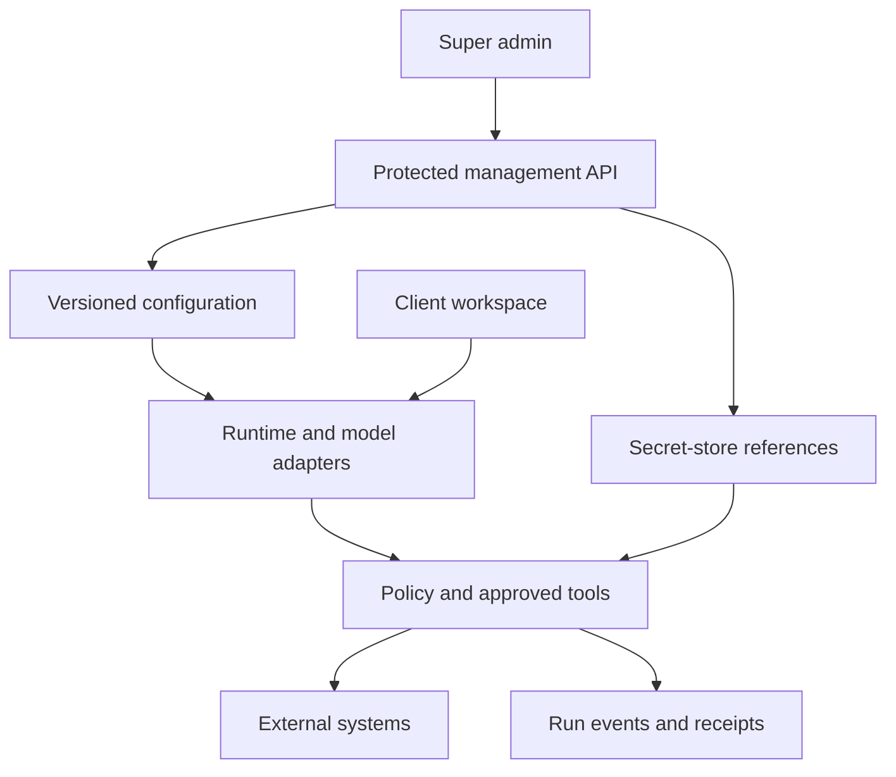
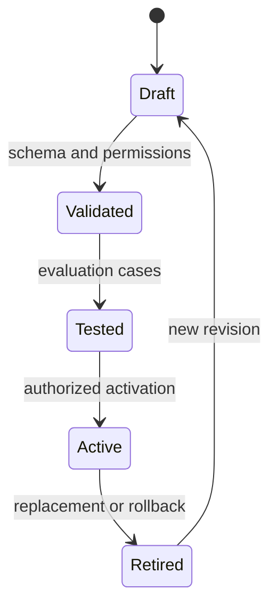

# Backend and super admin control contract

**Current package1.7:** public/admin host ownership has changed. Read the Package1.7 section below and document24 before applying older setup instructions.

**Current package 1.5: identity/MFA/read-only shell is implemented in source; config/credentials/runtime management remains planned. Original package 1.2 planning contract follows.** Owner-directed extension arising from [the recorded discussion](17_DISCUSSION_AND_DECISION_RECORD.md) and [ADR-0002](decisions/ADR-0002-configurable-agents-and-admin-control.md). Bizoveya already inherits server APIs and Supabase; this is an extension of that backend with a management layer, not the first backend or a replacement of the existing portfolio app.

## Configuration versus executable capabilities

Store supported settings as versioned data. The dashboard submits validated configuration to authenticated server APIs. Workers load an immutable configuration snapshot for each run and invoke the selected runtime/model/tools. Administrators do not edit arbitrary source code or execute arbitrary scripts through a settings form. SDK libraries are implementation dependencies; an AI agent is a configured role using them, not an imported ChatGPT session.

| Dashboard editable | Backend enforced | Requires software release |
|---|---|---|
| Agent name, role instructions, output schema selection from approved registry | Actor authorization, tenant isolation, tool allowlist enforcement | New tools, integrations, arbitrary output schema support |
| Model/profile selection from approved catalog, budgets and fallback order | Eligibility, compatibility, spend ceilings, bounded retries | New provider adapter or unsupported capability |
| QA checklists, approved facts requirements, test fixtures and review thresholds | URL/field/schema validation and action authorization | New validator implementation |
| Template content, categories, metadata and supported block arrangement | Allowed schema/components, content sanitation and preview boundary | New rendering components or layout engine |
| Workspace status, quotas, supported feature switches | Permission checks, revocation and action reconciliation | Auth/role architecture changes |

## Instruction hierarchy and conflict handling

1. Backend-enforced access and action controls apply regardless of model output or prompt text.
2. Platform/agent defaults are authored by authorized platform staff and versioned.
3. Workspace/site preferences express client brand, audience, approved sources and bounded scheduling settings.
4. Task instructions refine the current request within the above permission boundary.
5. Documents, websites and messages are evidence/data, not an authority to redefine tool permissions.

A client can request an additional review but cannot authorize access to another tenant, expand an agent's platform permissions, or bypass a mandatory action gate. Show a conflict rather than silently discarding a client request. Platform policy changes outside supported configuration still require a reviewed software release.

## Super admin modules and proposed routes

The table records original route proposals. Current package 1.5 implements only `/admin`, `/admin/audit` and the added `/admin/security`. Other entries remain proposed; exact source states are in document 20. All admin data is outside the public `/bizoveya/docs` room.

| Candidate route | Function | First scope |
|---|---|---|
| `/admin` | Clients/workspaces, recent activity, running/failed tasks, usage summary | Operational metrics with definitions |
| `/admin/agents`, `/admin/agents/[agentId]` | Role, instructions, tools, model profile, version history | Draft/test/activate/rollback |
| `/admin/models` | Approved providers/models, capabilities, geography and routing | Catalog and task-specific profiles |
| `/admin/credentials` | Add/replace/revoke provider credentials, health and expiry | Secure credential management room |
| `/admin/evaluations` | Saved cases, old/new comparison, validation failures | QA and tool-use regression set |
| `/admin/runs`, `/admin/runs/[runId]` | Status, redacted events, cost, snapshot, receipts | Pause/cancel/stop with reconciliation |
| `/admin/templates` | Supported templates, metadata, preview and publication version | Existing schema; no arbitrary script upload |
| `/admin/workspaces`, `/admin/workspaces/[workspaceId]` | Client lifecycle, grants, quota/support access | Scoped administration |
| `/admin/audit` | Actor/time/change reason and before/after version references | Redacted append-only audit |
| `/admin/settings` | Supported platform flags and operational policy | Restricted catalog only |

Clients use scoped `/workspaces/[workspaceId]/agents`, `/settings`, `/sites/[siteId]/integrations` and task/approval views. They never receive platform secrets or unrestricted global administration. Platform administrators, model/config editors, support officers and billing viewers may be separate roles; start with explicitly named minimal grants, not all-powerful shared accounts.

## Credential management contract

A model credential belongs to provider/project/environment and may serve multiple agents. Agent permissions and spend limits are independent. Client connector grants are scoped by workspace/site/provider and remain separate from platform model credentials.

- Store secret material only in a protected server secret store; the database holds a reference plus redacted status/version metadata. The exact store and encryption/key-management design are open decisions.
- The room can accept a new secret over an authenticated protected request, test it through a bounded server call, rotate/replace it and revoke future use. Never return the plaintext secret after saving or send it to agents/prompts/browser search indexes.
- Show provider, environment, owner, status, last test, expiry when supplied and a non-secret identifier. Redact logs, exports, screenshots, errors and audit diffs. Never log request bodies containing secrets.
- Use MFA and reauthentication for credential or global permission changes. Credentials cannot be self-elevated by a normal client. Production/staging credentials are distinct.
- Activate a new credential reference atomically after successful checks. Pin credential version references for traceability, define how already-running jobs transition, and reconcile in-flight actions when revoking; revocation cannot undo a completed remote write.
- Seed the first authorized administrator through a controlled operator process; public sign-up must not grant super admin. Provide tested break-glass recovery with audit. A dashboard is not a replacement for secret-manager access controls.
- Never embed real keys in Markdown, ZIPs or the public room. Runtime configuration updates can avoid a deployment when backed by this store; ordinary environment-variable changes may still require restart/redeployment.

## Configuration lifecycle

Versions are immutable after activation. Rollback switches to a known previous version; it does not erase history. Draft edits include reason, actor, time and affected scope. New runs use the active snapshot. In-flight runs retain their snapshot unless an authorized amendment is explicitly recorded at a safe checkpoint. Never silently change global instructions mid-run. Activation can start in a test workspace before broader rollout; exact pass thresholds are chosen using an evaluation baseline.

## Quality assurance example: Pinterest

The Pinterest agent prepares a title, description, target URL, selected board and asset from approved business information. The QA specialist assesses relevance, clarity, factual support and brand fit. Deterministic validators check required fields, allowed URLs/boards, actual provider limits, asset availability and duplicate-action identifiers. A person reviews any required channel action. Only the authorized integration executes it; receipt/readback determines outcome. A successful model review does not prove successful publication.

Admin updates to QA defaults must be evaluated against saved good/bad examples. Record false positives and missed defects. Models can share an error; additional model review is not a zero-error guarantee. Hard permission and duplicate-action controls belong to application code.

## Operational visibility and privacy

Define total registered clients, enabled workspaces, users active in an explicit time window, current tasks, failure categories, latency, token usage and estimated/actual billed cost separately. Online user counts require implemented presence/heartbeat expiry and clear definitions; a login record alone is insufficient. Avoid fictional metric values in demos. Private documents/transcripts require authorized support access with reason, scope, expiration and audit; global metrics do not automatically grant document access. Roles must be checked in every API/worker boundary, not only by hiding navigation.

Pause/stop controls prevent new scheduling/tool authorization. Already-started remote actions may finish; persist their results and reconcile. Do not claim a stop button instantly reverses published content. See [06_AGENT_OPERATIONS.md](06_AGENT_OPERATIONS.md).

## Implementation order and manual founder actions

| Scope | Phase | Required proof / owner action |
|---|---|---|
| Bootstrap admin, roles, MFA and protected shell | P01.4 after P01.3 tenancy | Founder configures named test admin; normal user denied |
| Credential references, catalog, agent config versions and runtime binding | P04.1–P04.3 | Configure test provider privately; test rotation and a real Nebius/NVIDIA run |
| Evaluations, activation, rollback, trace and stop controls | P04.4–P04.5 | Review cases; compare version outcomes; recover interrupted task |
| Template administration | P02.1 | Choose supported business template; test preview/publish/regression |
| Wider client/usage/support operations | P11.1 | Approve quota, privacy/support scope and cost policy |

Candidate SDK must demonstrate the required Nebius model path before adoption. The preferred provider-neutral design is not proof of adapter compatibility. Hosted agent services remain optional alternatives after terms, costs and capability review.

## Acceptance boundary

No admin UI, SDK, credentials vault, evaluation runner or new SQL is implemented by package 1.2. The full specification is publicly represented in the document room, but it contains no live secrets or private data. Implementation requires the permission, tenancy, rotation, config-version and failure tests in [11_VERIFICATION_AND_RELEASE.md](11_VERIFICATION_AND_RELEASE.md). Broad production-readiness claims remain prohibited until demonstrated.

## Package 1.3 transition and impact synchronization

Admin paths and proposed API families now have stable inventory IDs in [20_ROUTE_AND_TRANSITION_REGISTER.md](20_ROUTE_AND_TRANSITION_REGISTER.md). Connect configuration, credential, template and runtime changes to document 19 impact/event contracts. P01.4 admin identity/shell remains a planned work item, dependent on workspace tenancy; package 1.3 implements no admin handler, secret room or role bootstrap.

## Package 1.4 — first practical workspace implementation

The client workspace foundation now exists, but the protected platform administration described here does not. Workspace roles owner/editor/viewer are tenant-local; they confer no platform-admin or credential-room access. All `/admin` pages and API contracts remain planned. New membership writes are unavailable to browser clients; the first phase bootstraps only the creator's owner membership. Later admin/member operations must add tested audited contracts, not enable raw self-service role writes.

## Current package 1.5 — P01.4 source implementation

Three admin pages and two GET APIs now exist: overview, authenticator and access history, plus summary/audit endpoints. Explicit operator grant and current AAL2 session guard every global read in both app and database; the security page allows only eligible AAL1 accounts into setup. Four aggregate counts and latest 100 role events form the entire operational scope. Existing tenant/project row permissions are unchanged. No credential, agent configuration, template or runtime management is implemented yet.

Migration 019 and the controlled operator template implement grant/revoke with an atomic audit trigger. No first-signup admin, public grant endpoint or app service-role key exists. One restricted platform-admin capability set is provided; finer staff roles and fresh-auth-sensitive mutations are later work. Recovery runbook 21 is supplied and requires staging rehearsal. P01.4 is `[~]` source/local tests, with real MFA, DB and browser gates open alongside P01.3. Earlier package sections describe their historical unimplemented state.

## Package1.6 — recovery hardening only

Migration020 repairs the private operator function so an admin grant can be revoked after Auth soft deletion. New-grant eligibility and all existing app/DB read guards remain unchanged. Operator audit remains atomic and app-immutable, with trusted-database-operator limits described in runbook21. Local SQL tests now execute those controls and a regression reproduces the prior failure. Real MFA/Auth/PostgREST/recovery rehearsal is still pending; no configuration/vault/template/runtime management screen is added.

## Package1.7 — separate admin application (current contract)

This section supersedes earlier same-host admin/source-path instructions for the current package, while preserving those earlier delivery records. Under ADR-0004, public code is apps/web/src; admin code is apps/admin/src. Source folders are not URL prefixes. The main host has no /admin or /api/admin pages/handlers, no admin button or redirect. Admin-only paths belong to the separate host; / redirects to its /login, with approved-role/MFA checks for protected pages/APIs. Admin has no customer/docs/marketing routes. All canonical Markdown remains at root docs/platform and is visualized only by the main app. Both deploy independently from one repository/ZIP; shared Supabase/migrations remain centrally managed. See23 for founder-reported testing,24 for explicit install/deploy/environment/manual instructions, and ADR-0004 for the decision. No new migration or live domain configuration is delivered. Real admin Auth/MFA, tenant isolation and production acceptance remain pending. Current source paths elsewhere in prior historical sections must be interpreted through this ownership map.
