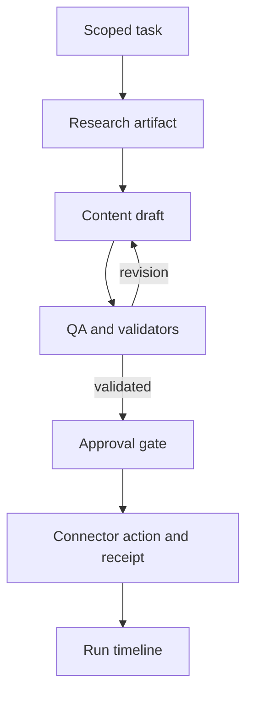

# Dependencies and change-impact register

**Current package1.7:** public/admin host ownership has changed. Read the Package1.7 section below and document24 before applying older setup instructions.

**Package 1.3 / P01.3 planning slice.** This is a living design register, not an implemented dependency controller. Update it with every feature, removal, fix, schema or configuration change. Latest owner instructions can revise the design; record the reason and affected items rather than silently replacing history. Route IDs and implementation states are canonical in [20_ROUTE_AND_TRANSITION_REGISTER.md](20_ROUTE_AND_TRANSITION_REGISTER.md).

## Ownership and stable identifiers

Use stable IDs independent of display name or URL. `R-` identifies an observed route, `W-` a planned workspace page, `A-` an admin page, `API-` a planned API contract, `C-` a capability, `E-` a domain event and `ACT-` a meaningful user action. IDs are never recycled after removal. Each implemented item must name its owner module, requirements, callers, authorization, input/output schema, storage, downstream consumers, failure/recovery behavior and tests. A button that only opens a menu belongs to its screen/component; a publish, upload, approval, activation or cancellation button needs an action contract. This keeps traceability useful without creating a separate ledger row for every decorative icon.

| Capability | Owner boundary | Depends on | Consumers / change impact | Planned proof |
|---|---|---|---|---|
| C-IDENTITY | Auth and membership service | Verified session, workspace membership, platform roles | Every protected page/API, RLS, agent tool scope, support access | Cross-tenant, direct-API, revoked-role and unauthenticated negatives |
| C-SITES | Site registry | C-IDENTITY, ownership declaration, site mode | Workspace navigation, knowledge, tasks, integrations, template choice | Two sites in one workspace; another workspace denied; URL-only registration causes no external write |
| C-TEMPLATES | Versioned template catalog and supported renderer | Approved schema/components, asset references | Builder, onboarding voice, preview, QA, admin template UI, presentation | New template discoverable through catalog; old portfolio renders; unsupported component rejected |
| C-COMMANDS | Existing validated editing/revision pipeline | Project permissions, document schema, supported commands | Manual editor, voice tools, preview, undo/revisions, publish | Same command validated across manual/voice callers; legacy fixture preserved |
| C-KNOWLEDGE | Site-scoped facts and retrieval | C-IDENTITY, C-SITES, extraction/provenance | Research, content, QA, website assistant, meetings | Scope isolation, fact correction, provenance and deletion propagation |
| C-CONFIG | Agent/config/model-profile versions | Platform roles, allowed tool schemas, evaluations | Runtime, admin, QA, cost policy | Draft/test/activate/rollback; running tasks retain pinned snapshot |
| C-CREDENTIALS | Server secret references and connector grants | Auth, secret store, rotation/revoke policy | Model gateway and individual connector adapters | No stored secret returned; revoked grant denies new operations |
| C-RUNTIME | Task coordinator and bounded workers | Config snapshot, model adapter, identity, knowledge, budget | Specialists, task timeline, meetings, approvals, metrics | Malformed output rejected; retry bounded; no duplicate side effect |
| C-APPROVALS | Action authorization and receipts | Actor role, artifact version, connector capability | CMS write, social action, code PR, publishing | Changed artifact invalidates approval; timeout reconciled before retry |
| C-CONNECTORS | Provider-specific adapters | Authorized grant, capability matrix, revision checks | Site inspection, CMS, Pinterest, GitHub/Vercel | Scope denial, conflict, readback and idempotency evidence |
| C-MEETINGS | Durable meeting/interrupt state | C-RUNTIME, scoped participants, task graph | Founder interventions, specialist handoffs, action items | Stop/pause/amend survive reload; in-flight action reconciled |
| C-OBSERVABILITY | Redacted audit/run/usage records | Event schemas, receipt IDs, cost/time definitions | Task UI, admin metrics, QA, support, release evidence | Defined metric window; secrets/private payloads excluded |
| C-DOCS | Canonical Markdown and visual projection | Current docs loader, phase/log/version formats | Public document dashboard and cross-chat handoff | Every current Markdown generates a linked page; history excluded |

## Template and voice-agent example

**Do not duplicate the complete template catalog in each agent prompt.** Planned catalog entries have stable template ID, version, category, supported document type, sections, editable fields, supported command IDs, preview/asset references and lifecycle state. The onboarding/voice adapter reads the authorized catalog through a bounded tool. Model reasoning proposes a supported command; the existing command validator decides whether it can execute. A new layout or command still requires code and tests; an admin form cannot create executable capabilities from prose.

| Change | Required downstream work | What does not automatically change |
|---|---|---|
| New template using existing sections/commands | Catalog/version, renderer mapping, picker/preview, knowledge/tool response, QA fixtures, manual and screenshots | Agent default prompt need not be rewritten if it discovers the catalog dynamically |
| New section or edit command | Document schema/version compatibility, renderer, command validator, voice tool contract, manual editor, QA, migration if needed | Stored old documents are not silently converted without compatibility plan |
| Retire a template | Hide from new selections; preserve renderer/version for existing sites; explain migration option | Published sites are not broken or auto-switched |
| Update template metadata | Invalidate affected catalog reads/cache; refresh supported UI and docs | Running tasks keep their recorded template/config version |

## Agent communication and task dependencies

Coordinator owns the task graph. Specialists communicate through typed artifacts and persisted task/run references, not unrestricted conversations or shared global memory. Each handoff carries workspace/site IDs, parent task, artifact/version, provenance, allowed next capability, approval requirement and config snapshot. A dependency can be required, optional or gated; a consumer can start only when its required inputs are valid. Quality review can request a bounded revision, but never recursively invoke itself forever.

An agent addition must specify role, input/output schema, permitted tools, budgets, upstream artifacts, downstream consumer, timeout/retry policy and evaluation fixtures. A client instruction cannot expand platform permissions. Changing a model profile requires tool/structured-output compatibility checks; replacing the reasoning provider does not replace account authorization, durable execution or integration code.

## Contract and event register — proposed

Events are emitted after a committed state transition. Use event ID, schema version, UTC occurred-at time, workspace/site scope, actor, entity/version, correlation/run ID and redacted payload. Persist source change and outbox atomically if asynchronous processing is introduced. Consumers deduplicate by event ID, tolerate supported schema versions and reconcile failed delivery. Do not add a queue solely for synchronous catalog reads.

| Event | Producer | Consumers | Invalidation / recovery |
|---|---|---|---|
| E-TEMPLATE-CHANGED | Template administration | Builder/voice catalog readers, preview cache, evaluations | Refresh new reads; preserve referenced old versions |
| E-KNOWLEDGE-CHANGED | Approved fact revision | Retrieval index, queued task validation, site assistant | Scope/version checks; delete affected derived records when required |
| E-CONFIG-ACTIVATED | Tested config activation | New-run resolver, audit | Existing runs stay pinned; rollback selects prior approved version |
| E-GRANT-REVOKED | Connector/credential service | Runtime and adapter authorization | Block new use immediately; reconcile in-flight receipts |
| E-ARTIFACT-CHANGED | Draft/task service | Approval gate, QA | Stale approval invalidated; validate new artifact version |
| E-TASK-INTERRUPTED | Meeting/task controls | Coordinator, worker, timeline | Cancellation token/status checked before side effect; resume only from reconciled state |
| E-ACTION-RECONCILED | Connector receipt service | Task timeline, audit, usage | Record actual remote state; retry only when safe |

## Change-impact procedure — required for every delivery

1. Identify changed requirement, capability, action and route IDs; inspect actual imports/callers, schema, grants and data ownership. This register is a starting map, not proof that all runtime dependencies are known.
2. Follow direct and transitive dependencies. Classify code, configuration, persisted data, external connector, customer UX and documentation impacts; record unaffected checks with a reason where useful.
3. Define compatibility and rollout: schema version, existing-record handling, contract change, cache/index refresh, in-flight runs, permissions, migration and rollback. Never rewrite applied SQL migrations or delivered ZIP history.
4. Implement the bounded slice; run relevant producer/consumer contract tests, affected regression and authorization tests. Live connector effects require actual scoped authorization and redacted receipts.
5. Update every affected canonical document plus manual/presentation for visible changes; rebuild the visual room. Append activity, completed-only result, package filename and verification evidence. Review orphaned navigation, retired actions and stale instructions.

| Impact record field | Required evidence |
|---|---|
| Change ID / actor / timestamp | Activity event, package or source commit; exact model identity only when known |
| Changed entities / requirements | Stable IDs, paths and before/after contract/config versions |
| Direct / transitive consumers | Modules, routes, actions, storage, integrations and documentation |
| Safety / compatibility | Tenant grants, data migration, approval validity, in-flight run policy |
| Verification / release | Commands/results, relevant manual actions, rollback and unresolved gaps |

Initially maintain this register in Markdown and enforce it in handoffs/review. Later derive route/catalog metadata and validate missing references in CI when the real implementation warrants it. A centralized AI 'dependency controller' is **not** required, and cannot replace explicit module contracts or tests.

## Package 1.4 — first practical workspace implementation

## Change impact — package 1.4 workspace source implementation

| Changed entity / action | Producer and consumers | Compatibility / permission impact | Verification / remaining gate |
|---|---|---|---|
| C-IDENTITY / C-SITES; ACT-WORKSPACE-CREATE | Cookie session → workspace RPC → selector/overview | Atomic creator membership; no platform role; no direct self-grant | API/service tests; staging SQL pending |
| ACT-SITE-REGISTER; W-003 | Strict form/schema → scoped API/RPC → site list/detail/counters | URL registration does not fetch/write; native link requires original owner; business mode is planning | Domain/service/UI tests; two-site live walkthrough pending |
| ACT-SITE-UPDATE; W-004 / API-003 | Metadata form → RPC → record/list/overview | Expected-version conflict; URL reattestation; mode/link immutable; registry status only | Conflict/schema tests; live concurrent sessions pending |
| ACT-WORKSPACE-RENAME; W-014 / API-020 | Settings → owner-only RPC → navigation/selector | Name/version only; role/ownership unchanged | Owner/editor service tests; live preview pending |
| Legacy project link/deletion | Native registry FK and Studio/publication routes | No project RLS or command change; ON DELETE SET NULL preserves deletion | Existing regression tests; staging mapping/delete script pending |
| Navigation / metadata | `/projects`, `/start`, root applicationName, robots | Adds workspace entry; keeps all public/share/editor URLs; private routes noindex | Build/static checks; browser and legacy live smoke pending |
| C-DOCS / package metadata | Canonical sources → existing document renderer/dashboard | 30 Markdown documents, no history projection; package 1.4, stable work IDs | Full projection/link/source/archive checks |

No domain-event bus, template-catalog runtime, agent handoff executor or dependency-controller service is installed. Actor/time/package evidence is in ACTIVITY_LOG; exact changed paths/hashes and checks are in the delivery JSON. Future consumers must implement their own contracts rather than interpret this first registry as a grant to act on external accounts.

## Package 1.5 — admin change-impact record

| Action/capability | Producer / dependencies | Consumers / effects | Failure and verification |
|---|---|---|---|
| ACT-ADMIN-GRANT / C-IDENTITY | Trusted operator procedure; existing Auth user; migration 019 | Own eligibility RPC, protected page/API guards, grant counter, role-change audit | Invalid subject/reason rejected; no client EXECUTE; repeated grant is no-op |
| ACT-ADMIN-MFA / C-IDENTITY | Approved account; Supabase TOTP and SSR cookies | AAL2 permission for overview/audit RPCs and pages | Wrong code stays denied; reload/session proof pending; no stored setup secrets |
| ACT-ADMIN-REVOKE / C-IDENTITY | Operator deletion of grant | Next global page/API/RPC denied; audit records revocation | Cannot retract data already seen; no cached positive grants; staging revocation assertion |
| C-OBSERVABILITY admin reads | Current DB grant+AAL2, workspace tables and audit | Overview counts and latest-100 UTC timeline | Strict output shape; no private tenant content; no fictitious metrics |
| C-DOCS | All affected canonical sources plus runbook 21 | Existing public room, phase/status/manual/handoff | Rebuild projection and verify links/route IDs; operational audit stays private |

Owner modules: `src/features/admin/{access,api,page-data,store,mfa,frame,views}` and migration 019. New route IDs R-056–R-060; A-001/A-012 implemented, A-014 security added; API-019 implemented, API-021 summary added. No queue/domain-event bus is needed for immediate DB grant reads. Existing workspace/portfolio mutation and voice/template paths remain byte-preserved. Future staff roles or admin writes must update the DB guard, app gate, audit/schema, all consumers, tests and this impact record together.

## Package1.6 — dependency repair and verification

| Change / work item | Producer and dependencies | Affected consumers | Proof / remaining boundary |
|---|---|---|---|
| P01.4.Fix-1 / ACT-ADMIN-REVOKE | Auth account lifecycle; private operator function; migration020 | Grant eligibility, revocation, audit, recovery runbook | Failing019/passing020 SQL regression; real Auth lifecycle still needs staging |
| P01.1.Fix-1 / C-DOCS | Recorded ZIP table rows and current document inventory | Dashboard hero/metrics/sidebar, detail metadata, phase summary wording | Parser/component/browser regression; future ZIP record updates flow through on rebuild |
| P01 local verification | Actual migration files plus explicit local fixtures; browser on loopback | Test evidence, phase gates, handoff, source-preservation claims | No provider or hosted-environment assumptions; no new runtime dependency |

Route IDs R-030/R-031 are changed in source; R-056–R-060 and workspace routes are exercised but not structurally changed. The dependency register remains documentary rather than an autonomous controller. Update tests if the package-table contract changes. Optional test tooling is separate from the production app dependency graph.

## Package1.7 — separate admin application (current contract)

This section supersedes earlier same-host admin/source-path instructions for the current package, while preserving those earlier delivery records. Under ADR-0004, public code is apps/web/src; admin code is apps/admin/src. Source folders are not URL prefixes. The main host has no /admin or /api/admin pages/handlers, no admin button or redirect. Admin-only paths belong to the separate host; / redirects to its /login, with approved-role/MFA checks for protected pages/APIs. Admin has no customer/docs/marketing routes. All canonical Markdown remains at root docs/platform and is visualized only by the main app. Both deploy independently from one repository/ZIP; shared Supabase/migrations remain centrally managed. See23 for founder-reported testing,24 for explicit install/deploy/environment/manual instructions, and ADR-0004 for the decision. No new migration or live domain configuration is delivered. Real admin Auth/MFA, tenant isolation and production acceptance remain pending. Current source paths elsewhere in prior historical sections must be interpreted through this ownership map.
