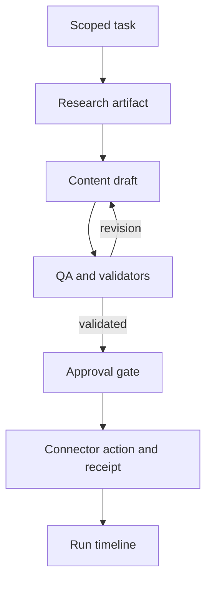

# Dependencies and change-impact register

## Current checkpoint — 1.20 / P04.3.3.1

Private campaign draft storage is implemented at `/workspaces/[workspaceId]/sites/[siteId]/campaigns`, with saved campaign URLs ending in `/[campaignId]`. This checkpoint stores manually authored brief/blog/Pinterest/LinkedIn text; it makes no model request and does not publish. Additive migration033 follows032. P04.3.3 remains in progress: bound-agent orchestration, generation reservations, durable execution/usage and output review are the next work on the SAME `phase/p04-3-3-durable-drafts` branch. See [40 Campaign drafts](40_CAMPAIGN_DRAFTS_AND_TESTING.md).

Founder screenshots on2026-10-03 confirm Gemini connectivity and MT107 settlement:20 input/7 output tokens, pricingv1, held/count amounts$0, run `e5be1ac3-5620-40e0-9498-97febb96fb15`. MT103 saved policy/history is evidenced; refresh persistence is not separately reported. Other unevidenced manual gates stay pending. Pakistan Token Factory onboarding is blocked; Builder application is under review. Nebius support email was drafted for the founder, not sent by the assistant. No main merge, production deployment, hosted SQL or provider call performed.

## Historical contract — 1.19 / P04.3.2

This update supersedes conflicting older “current” blocks below; historical records remain unchanged. Admin-only spending controls are at `/admin/spending` and `/api/admin/spending`. Migration032 follows031; never rerun applied migrations. New connectivity tests require reviewed USD pricing and enabled limits. The ledger reserves a conservative estimate before a provider call, settles reported usage, and holds uncertain/overrun charges until evidence-based reconciliation. Customer draft generation and publishing remain disabled. See [39 Spending controls](39_SPENDING_CONTROLS_AND_TESTING.md).

Founder reported all1.18 MT095–101 passed on2026-10-03; this is founder-reported local acceptance, not independent deployment verification. New MT102–109 remain pending. GitHub write access is restored; delivery uses `phase/p04-3-2-spending-controls`, not main. Main was inspected at1.7; this branch carries cumulative1.19 source. See38 and CONTINUATION for delivery state.

## Historical snapshot — 1.18 / P04.3.1

Reviewed model assignments are implemented at `/admin/bindings` and `/api/admin/bindings` on the separate admin host only. Migration 031 is additive after 030. An assignment pins a checked latest preview-approved agent version, matching-tier checked model profile, enabled credential-reference version and successful matching connectivity-test ID. Evidence must remain less than 24 hours old. Version changes, rotation, revocation or expiry require review; disable retains history. This is assignment configuration, not paid execution, budget enforcement or customer draft generation.

Use [37 Agent model assignments](37_AGENT_MODEL_ASSIGNMENTS.md) for setup and pending MT095–101. Next are P04.3.2 spending controls, P04.3.3 durable text drafts, and P04.3.4 visual composition. Publishing remains deferred. The founder's successful local Gemini test is accepted only for the evidenced case; all other unevidenced manual tests stay pending.

The founder approved one branch/PR per phase and six-hour continuation. GitHub reads succeeded but branch creation returned HTTP403 `Resource not accessible by integration`. No remote branch, commit or PR was created. The schedule was created then paused pending write access. See [38 Delivery and continuation](38_DELIVERY_AND_CONTINUATION.md). Earlier contracts below remain historical where superseded.

## Current contract — package1.17 / P04.0

P04.0 adds an admin-only model connectivity room at /admin/model-tests and /api/admin/model-tests. The saved provider/model uses the AI SDK with fixed OpenAI, Nebius Token Factory and Gemini adapters. It sends a fixed synthetic prompt, requests128 output tokens, waits20 seconds, makes no automatic retry/fallback, and stores redacted results with profile/reference versions, actor, reason and timestamps. No customer knowledge or prompt is sent. This is connectivity evidence, not quality evaluation, agent activation or a spending-budget implementation.

Live tests default off. Explicit operator setup requires the selected private provider key plus an admin-only SUPABASE_SERVICE_ROLE_KEY for server-attested result recording, then BIZOVEYA_ENABLE_MODEL_TESTS=true and per-request pricing/charge acknowledgement. No secret-entry form exists. Named current admin+AAL2 is required; client roles cannot mark results passed. Additive030 enforces one running test and five attempts per UTC day platform-wide, durable request IDs, expiry/unknown states and version-sensitive evidence. Failures/unknown attempts still consume the attempt allowance and may be billed. Existing dailyBudgetCents remains planning metadata; monetary enforcement precedes customer runtime.

Read36_MODEL_CONNECTIVITY_AND_TESTING.md for exact setup, supported evidence and MT087–094. All1.16 tests and earlier unevidenced founder gates stay pending; the founder is currently testing and has supplied no new pass results. Preserve001–029 and historical files. One cumulative ZIP/repository and the same two Vercel roots. No hosted SQL/deploy/provider request was performed by the assistant. Next implementation dependency: reviewed exact-model evidence, agent/profile binding, enforced monetary limits and durable draft runs, then visual output composition. The35 draft-only pilot and34 Studio/removal scope remain in force; publishing remains deferred.

Earlier release contracts below are historical and superseded where they conflict with this current contract.

## Historical contract — package1.16 / P02.5

The initial new-website audience is freelancers, consultants and small digital-service agencies. Existing sites remain niche-independent registrations. P02.5 repairs Studio and adds owner-only permanent site-record removal: collapsible workspace navigation (collapsed on Studio entry), bounded independently scrolling panels, whole-card section selection, canvas-local selected-section scrolling, homepage Hero/FAQ placement rules, explicit legacy order repair, 120-character headline/320-character hero introduction with counters, bounded responsive photo frames with fitting/focus, optional shared HTTPS logo, sample-fill with confirmation/Undo, section navigation/mobile menu and focused Professional Practice/Creative Business styling. Shared rendering serves preview and existing snapshot publication. No silent legacy row rewrite or automatic sample save/publish.

Additive029_business_studio_and_site_removal.sql preserves001–028. It accepts optional logo/photo metadata, keeps legacy read compatibility, enforces editorial rules on new saves/publication, and exposes owner-only version/name-confirmed bz_delete_site. Site removal cascades this site's business draft/public snapshots/history, knowledge/revisions/events and agent preferences, retaining a content-free owner-readable removal event. External hosting and original portfolio projects remain intact. This is permanent removal, not archiving/restoration. Old duplicate records are removed individually by their owner; no automatic merge.

The first agent pilot is now drafts only for doitwithai.tools: blog, Pinterest copy+rendered graphic, LinkedIn post and rendered carousel/PDF. This phase documents the pilot; live model execution and visual generation are not implemented here. Five proposed roles (coordinator, writer, QA, Pinterest, LinkedIn) share a future visual composer. Social OAuth and CMS writes are not prerequisites for draft generation. Model provider qualification/binding/enforced budget and stored runs remain prerequisites. Multipage/custom collections/listing-entry/navigation/media uploads/gallery/video blocks remain planned; current business sites still have one homepage with section navigation.34 contains current repairs/manual cases;35 contains pilot briefs and owner-reviewable starter knowledge.30 remains cumulative.

Founder reported all newly created Supabase files applied in the review; record this as founder-reported through028 setup, not independently verified database state. Studio/onboarding/deletion findings are open until owner retests1.16. Earlier unspecified acceptance/security gates remain pending. This is a living plan; subsequent founder instructions can revise it, with affected documents, code, migration, dependency and activity records updated together. One cumulative ZIP/repository, two existing Vercel app roots. No remote database/deployment/provider action performed.

Earlier sections remain historical; this current contract supersedes conflicts.

## Historical contract — package1.15 / P04.2.1

Provider/ref registry change affects contracts + private SQL + server fixed env map + forms/tests/docs. Profile save appends immutable version and resets current checked status. Reference enabled/rotation version change invalidates dependent checks automatically; raw env change requires explicit record-rotation. Future agent binding must pin checked profile/ref versions and revalidate at task start. Current P04.1 previews do not depend on new profiles and remain unchanged.

P04.2.1 adds model-profile preparation and fixed credential references on the separate admin host. /admin/models saves immutable candidate versions and checks syntax/reference eligibility; /admin/credentials enables/disables or records rotation of the three fixed platform references. All reads/writes require current named admin+AAL2 in server and SQL. No key value is stored in the database or accepted by these forms/APIs. Keys are optional server-only BIZOVEYA_NEBIUS_API_KEY, BIZOVEYA_OPENAI_API_KEY or BIZOVEYA_GEMINI_API_KEY variables managed privately in deployment settings. Presence checks return only a boolean for the current admin deployment, providerValidated:false and runtimeEnabled:false. They do not authenticate providers or prove model availability.

No live calls, SDK runtime, secret-entry dashboard, actual provider revocation, model evaluation, profile-to-agent binding, fallback execution or enforced spend budget is implemented. Profiles remain candidates; tiers/token/budget values are future runtime metadata. Disabling a reference or recording rotation increments its version and invalidates prior dependent profile checks. Changing an environment variable alone is not detected as rotation; operator must redeploy and record it. Checks record current reference eligibility, not credential health. Admin scope remains separate from customer tenancy.

Additive028_model_profiles.sql preserves001–027 and historical data.32 profile definitions/100 versions each; latest30 versions and100 events displayed, older records retained. Same cumulative source repository and two Vercel projects. Optional provider variables belong on admin server for presence checks; a future runtime deployment must be configured independently. No key is needed to test missing-key states; no provider call/spend performed. See33 for exact workflow/new MT068–074;30 accumulates all pending steps. No founder test result was supplied by the continuation request, so all unevidenced acceptance remains pending.50 previous current MD plus33 and ADR-0012 makes52 current sources after rebuild.

Earlier sections retain history; this current contract supersedes conflicts.

## Historical contract — package1.14 / P04.1

Changing role/capability/output schema requires shared contract + SQL validation/catalog + both app consumers + tests + docs. New role requires code/migration, not only dashboard text. Changing default rules appends version, then check/review/preview pointer update; existing preview remains pinned. Knowledge approve/revoke/correct → next context preview changes; preference save → version conflict invalidates stale preview requests. New template does not mutate rules automatically; template registry remains separate until explicit future tool-context integration. No live run cache exists.

P04.1 implements agent configuration and readiness only. The separate admin host has /admin/agents: versioned drafts, schema/capability checks, human approval for context preview, review events, revocation and rollback to a previously checked version. Three migration-authored starter drafts (coordinator, content, quality) begin unchecked and unapproved. A saved edit creates a new immutable version; previous preview approval remains pinned until explicitly changed or revoked. Editing does not activate an agent. No live model execution, credential store, SDK runtime, external tools, provider calls or API spend is added.

Customer route /workspaces/[workspaceId]/sites/[siteId]/agents supports versioned site preferences and a current approved-knowledge context preview. Owner/editor write preferences; viewer reads. The backend checks membership/site binding, exact agent preview version and preferences version. Facts carry source/fact/revision citations. Platform instructions remain admin-only; platform admin alone cannot read customer knowledge. Client guidance and uploaded facts cannot grant permission. Preview is a snapshot, not a model answer; future execution must revalidate all approvals and versions.

Additive027_agent_configuration.sql retains001–026 and old project data. One shared @bizoveya/agent-contract workspace package defines typed role/capability/request contracts for both apps. The lockfile adds workspace links; third-party dependency versions stay unchanged. No new environment variable, model key, repository or deployment project. Upload packages/ along with both apps and rebuild both Vercel projects. See32 for exact setup, limits, routes and manual cases;30 combines all deferred actions. Founder has started testing but reported no results yet, so every unevidenced manual gate remains pending.

Earlier sections retain history and are superseded where they conflict with this current contract.

## Historical contract — package1.13 / P03.1

Knowledge dependency edges: source edit -> new source revision -> approval reset -> excludes current retrieval; owner approve -> current approved facts/citations; revoke/delete -> retrieval exclusion; delete -> all source revisions erased but content-free event retained. Future agent snapshots must pin sourceId/version/factId and re-check approval/membership before actions. No outbox/vector purge/controller is claimed implemented.

P03.1 adds a private knowledge room to every registered site mode. Sources may be pasted or imported as UTF-8 .txt/.md, reviewed as editable fact candidates, saved with revisions, and explicitly approved by the workspace owner. Changes remove approval; retrieval is authenticated, current, approved-only and site-scoped. Editors draft; viewers read; only owners approve/revoke/delete. No model call, API key, embeddings, PDF/OCR, public chatbot or automatic website update is added. Additive026 supplies private sources/revisions/content-free activity events and membership-gated RPCs. See31 for behavior and30 for all pending manual/setup steps. All previously deferred founder tests remain pending.

Earlier sections retain historical delivery context and are superseded where they conflict with this current contract.

## Historical contract — package1.12 / P02.4

New template ID affects catalog, Zod enum,025 SQL validator, page metadata/link/query selection, creation radio cards, Studio preset list, SVG/styles, preview/public parser, tests/manuals/docs. Future agents must consume catalog IDs/version when implemented; no running agent exists to update now. Schema changes require forward migrations, public projection compatibility and legacy regression. P02.4 adds Wellness Studio, Education Academy and Product Launch: six business families total. One catalog drives schema, template pages, creation and Studio; the shared section renderer also serves published snapshots. Additive025 expands accepted IDs without rewriting old data. Eight section types/nineteen layouts remain unchanged. No booking, checkout, LMS, enquiry inbox, custom domains or agents are added. See29 for template scope and30 for the combined pending setup/tests. Manual acceptance remains pending.

Older delivery sections retain history; this current contract supersedes conflicting capability/setup statements.

## Historical contract — package1.11 / P02.3.1

| Capability/change | Affected consumers | Required evidence |
|---|---|---|
| Business schema/section/layout | Draft validator,024 projection, public parser, preview, metadata, saved snapshots | Old snapshot compatibility + hidden/unused payload negatives |
| Save version | Publish expected draft version + Studio status | Private save leaves live snapshot intact |
| Publication action/version | API/store/RPC, current state/history, UI, visitor route | Conflict, idempotent unchanged call, rollback, unpublish404 |
| Membership/site mode | Draft/publication member reads and mutation | Viewer/outsider denied; external site cannot publish |
| Contact fields | Readiness, SQL gate, renderer email/call, manual tests | Email-only/phone-only actionable public page |
| Public route/origin | Visitor URL, metadata canonical, links, domain policy | Anonymous fresh request and correct canonical origin |

Native business publishing now uses an explicit saved snapshot and `/sites/[siteId]` visitor route. Saves remain private; publishing/republishing/unpublishing use membership checks, draft/publication version conflicts, and additive024. Hidden sections are removed from anonymous payloads; full snapshot history stays member-only. Owner/editor can publish; viewer cannot. Custom domains, enquiry-form delivery and AI agents remain planned. See28 for setup/manual acceptance and ADR-0008 for architecture. Admin app and inherited portfolio remain unchanged.

Earlier release sections retain history and are superseded where they conflict with this current contract.

## Historical contract — package1.10 / P02.2.Fix-1

Impact chain for this fix: template catalog → creation UI/query intent → register schema → workspace API/store → atomic SQL initial draft → Studio preview/version/save → site cards → manual/QA/evidence/visual docs. Identity key contracts affect create, edit, rename, conflict messages, duplicate annotations, indexes and operator report. Changing a template style reuses BusinessPreview/section contracts; future voice/agent consumers remain planned and must read the same catalog rather than duplicated prompt facts. Main header auth changes must not alter admin access.

Earlier release sections retain history; this current contract supersedes conflicting behavior descriptions.

## Historical contract — package1.9 / P02.2

| Change | Affected consumers | Required checks |
|---|---|---|
| Add section type/layout | domain catalogue/schema, SQL validator via NEW migration, preview, inspector, preset tests, manual/spec | Supported/unsupported payloads, role checks, old drafts, all variants |
| Add preset using existing types | shared recipe/catalogue, gallery, demo route/sitemap, screenshots, docs; future agent discovery | Content/ID preservation, route rendering, section count limit |
| Change shared fact | all bound hero/about/services/contact instances; future knowledge sync | One edit updates every bound consumer; no independent stale copy |
| Retire preset | catalogue selection + retained old renderer/schema; data migration decision | Existing saved sites preserved, no forced silent switch |
| Change section identity | undo state, imported JSON, renderer anchors, future agent commands | No collisions/broken contact anchors; actual upgrade plan |
| Change image handling | URL schema/SQL, renderer, privacy guidance, asset policy | Unsafe references rejected; failed/no-photo layouts work |

Implemented catalogue is static typed metadata, not a dependency-controller service or autonomous agent refresh. Adding capability requires tests and documentation in the same delivery.

Earlier dated sections below retain history; this current contract supersedes conflicting instructions.

## Historical contract — package1.8 / P02.1

| Change node | Affected nodes | Required verification |
|---|---|---|
| Business schema/template ID | catalog, workbench, preview, SQL021 validator/RPC, save schema, manual | Valid/invalid payloads, migration compatibility |
| New template metadata | shared catalog, gallery, onboarding, future agent knowledge/profile version | Route/card consistency; no agent update claimed before agents exist |
| Root/homepage entry | old demo links, login copy, manifest, sitemap, manual, presentation | `/portfolio` regression; new journeys |
| Draft access/role change | editor readonly state, API, RLS/RPC, viewer/revocation tests | Cross-tenant/role denial and no stale overwrite |
| Draft save behavior | workbench status/download/dirty warning, API/store, docs | Save/reload/version-conflict |

Business API and preview share the same domain schema. Avoid separate hardcoded template descriptions in future agents: bind catalog ID/version. Current catalog metadata lives in apps/web/src/domain/business.ts; layout remains code. Backward schema changes require a forward migration and ADR, not rewriting021 after application.

Earlier sections below retain planning/delivery history; conflicting capability or path descriptions are superseded by this current contract and document25.

**Package 1.3 / P01.3 planning slice.** This is a living design register, not an implemented dependency controller. Update it with every feature, removal, fix, schema or configuration change. Latest owner instructions can revise the design; record the reason and affected items rather than silently replacing history. Route IDs and implementation states are canonical in [20_ROUTE_AND_TRANSITION_REGISTER.md](20_ROUTE_AND_TRANSITION_REGISTER.md).

## Ownership and stable identifiers

Use stable IDs independent of display name or URL. `R-` identifies an observed route, `W-` a planned workspace page, `A-` an admin page, `API-` a planned API contract, `C-` a capability, `E-` a domain event and `ACT-` a meaningful user action. IDs are never recycled after removal. Each implemented item must name its owner module, requirements, callers, authorization, input/output schema, storage, downstream consumers, failure/recovery behavior and tests. A button that only opens a menu belongs to its screen/component; a publish, upload, approval, activation or cancellation button needs an action contract. This keeps traceability useful without creating a separate ledger row for every decorative icon.

| Capability | Owner boundary | Depends on | Consumers / change impact | Planned proof |
|---|---|---|---|---|
| C-IDENTITY | Auth and membership service | Verified session, workspace membership, platform roles | Every protected page/API, RLS, agent tool scope, support access | Cross-tenant, direct-API, revoked-role and unauthenticated negatives |
| C-SITES | Site registry | C-IDENTITY, ownership declaration, site mode | Workspace navigation, knowledge, tasks, integrations, template choice | Two sites in one workspace; another workspace denied; URL-only registration causes no external write |
| C-TEMPLATES | Versioned template catalog and supported renderer | Approved schema/components, asset references | Builder, onboarding voice, preview, QA, admin template UI, presentation | New template discoverable through catalog; old portfolio renders; unsupported component rejected |
| C-COMMANDS | Existing validated editing/revision pipeline | Project permissions, document schema, supported commands | Manual editor, voice tools, preview, undo/revisions, publish | Same command validated across manual/voice callers; legacy fixture preserved |
| C-KNOWLEDGE | Site-scoped facts and retrieval | C-IDENTITY, C-SITES, extraction/provenance | Research, content, QA, website assistant, meetings | Scope isolation, fact correction, provenance and deletion propagation |
| C-CONFIG | Agent/config/model-profile versions | Platform roles, allowed tool schemas, evaluations | Runtime, admin, QA, cost policy | Draft/test/activate/rollback; running tasks retain pinned snapshot |
| C-CREDENTIALS | Server secret references and connector grants | Auth, secret store, rotation/revoke policy | Model gateway and individual connector adapters | No stored secret returned; revoked grant denies new operations |
| C-RUNTIME | Task coordinator and bounded workers | Config snapshot, model adapter, identity, knowledge, budget | Specialists, task timeline, meetings, approvals, metrics | Malformed output rejected; retry bounded; no duplicate side effect |
| C-APPROVALS | Action authorization and receipts | Actor role, artifact version, connector capability | CMS write, social action, code PR, publishing | Changed artifact invalidates approval; timeout reconciled before retry |
| C-CONNECTORS | Provider-specific adapters | Authorized grant, capability matrix, revision checks | Site inspection, CMS, Pinterest, GitHub/Vercel | Scope denial, conflict, readback and idempotency evidence |
| C-MEETINGS | Durable meeting/interrupt state | C-RUNTIME, scoped participants, task graph | Founder interventions, specialist handoffs, action items | Stop/pause/amend survive reload; in-flight action reconciled |
| C-OBSERVABILITY | Redacted audit/run/usage records | Event schemas, receipt IDs, cost/time definitions | Task UI, admin metrics, QA, support, release evidence | Defined metric window; secrets/private payloads excluded |
| C-DOCS | Canonical Markdown and visual projection | Current docs loader, phase/log/version formats | Public document dashboard and cross-chat handoff | Every current Markdown generates a linked page; history excluded |

## Template and voice-agent example

**Do not duplicate the complete template catalog in each agent prompt.** Planned catalog entries have stable template ID, version, category, supported document type, sections, editable fields, supported command IDs, preview/asset references and lifecycle state. The onboarding/voice adapter reads the authorized catalog through a bounded tool. Model reasoning proposes a supported command; the existing command validator decides whether it can execute. A new layout or command still requires code and tests; an admin form cannot create executable capabilities from prose.

| Change | Required downstream work | What does not automatically change |
|---|---|---|
| New template using existing sections/commands | Catalog/version, renderer mapping, picker/preview, knowledge/tool response, QA fixtures, manual and screenshots | Agent default prompt need not be rewritten if it discovers the catalog dynamically |
| New section or edit command | Document schema/version compatibility, renderer, command validator, voice tool contract, manual editor, QA, migration if needed | Stored old documents are not silently converted without compatibility plan |
| Retire a template | Hide from new selections; preserve renderer/version for existing sites; explain migration option | Published sites are not broken or auto-switched |
| Update template metadata | Invalidate affected catalog reads/cache; refresh supported UI and docs | Running tasks keep their recorded template/config version |

## Agent communication and task dependencies

Coordinator owns the task graph. Specialists communicate through typed artifacts and persisted task/run references, not unrestricted conversations or shared global memory. Each handoff carries workspace/site IDs, parent task, artifact/version, provenance, allowed next capability, approval requirement and config snapshot. A dependency can be required, optional or gated; a consumer can start only when its required inputs are valid. Quality review can request a bounded revision, but never recursively invoke itself forever.

An agent addition must specify role, input/output schema, permitted tools, budgets, upstream artifacts, downstream consumer, timeout/retry policy and evaluation fixtures. A client instruction cannot expand platform permissions. Changing a model profile requires tool/structured-output compatibility checks; replacing the reasoning provider does not replace account authorization, durable execution or integration code.

## Contract and event register — proposed

Events are emitted after a committed state transition. Use event ID, schema version, UTC occurred-at time, workspace/site scope, actor, entity/version, correlation/run ID and redacted payload. Persist source change and outbox atomically if asynchronous processing is introduced. Consumers deduplicate by event ID, tolerate supported schema versions and reconcile failed delivery. Do not add a queue solely for synchronous catalog reads.

| Event | Producer | Consumers | Invalidation / recovery |
|---|---|---|---|
| E-TEMPLATE-CHANGED | Template administration | Builder/voice catalog readers, preview cache, evaluations | Refresh new reads; preserve referenced old versions |
| E-KNOWLEDGE-CHANGED | Approved fact revision | Retrieval index, queued task validation, site assistant | Scope/version checks; delete affected derived records when required |
| E-CONFIG-ACTIVATED | Tested config activation | New-run resolver, audit | Existing runs stay pinned; rollback selects prior approved version |
| E-GRANT-REVOKED | Connector/credential service | Runtime and adapter authorization | Block new use immediately; reconcile in-flight receipts |
| E-ARTIFACT-CHANGED | Draft/task service | Approval gate, QA | Stale approval invalidated; validate new artifact version |
| E-TASK-INTERRUPTED | Meeting/task controls | Coordinator, worker, timeline | Cancellation token/status checked before side effect; resume only from reconciled state |
| E-ACTION-RECONCILED | Connector receipt service | Task timeline, audit, usage | Record actual remote state; retry only when safe |

## Change-impact procedure — required for every delivery

1. Identify changed requirement, capability, action and route IDs; inspect actual imports/callers, schema, grants and data ownership. This register is a starting map, not proof that all runtime dependencies are known.
2. Follow direct and transitive dependencies. Classify code, configuration, persisted data, external connector, customer UX and documentation impacts; record unaffected checks with a reason where useful.
3. Define compatibility and rollout: schema version, existing-record handling, contract change, cache/index refresh, in-flight runs, permissions, migration and rollback. Never rewrite applied SQL migrations or delivered ZIP history.
4. Implement the bounded slice; run relevant producer/consumer contract tests, affected regression and authorization tests. Live connector effects require actual scoped authorization and redacted receipts.
5. Update every affected canonical document plus manual/presentation for visible changes; rebuild the visual room. Append activity, completed-only result, package filename and verification evidence. Review orphaned navigation, retired actions and stale instructions.

| Impact record field | Required evidence |
|---|---|
| Change ID / actor / timestamp | Activity event, package or source commit; exact model identity only when known |
| Changed entities / requirements | Stable IDs, paths and before/after contract/config versions |
| Direct / transitive consumers | Modules, routes, actions, storage, integrations and documentation |
| Safety / compatibility | Tenant grants, data migration, approval validity, in-flight run policy |
| Verification / release | Commands/results, relevant manual actions, rollback and unresolved gaps |

Initially maintain this register in Markdown and enforce it in handoffs/review. Later derive route/catalog metadata and validate missing references in CI when the real implementation warrants it. A centralized AI 'dependency controller' is **not** required, and cannot replace explicit module contracts or tests.

## Package 1.4 — first practical workspace implementation

## Change impact — package 1.4 workspace source implementation

| Changed entity / action | Producer and consumers | Compatibility / permission impact | Verification / remaining gate |
|---|---|---|---|
| C-IDENTITY / C-SITES; ACT-WORKSPACE-CREATE | Cookie session → workspace RPC → selector/overview | Atomic creator membership; no platform role; no direct self-grant | API/service tests; staging SQL pending |
| ACT-SITE-REGISTER; W-003 | Strict form/schema → scoped API/RPC → site list/detail/counters | URL registration does not fetch/write; native link requires original owner; business mode is planning | Domain/service/UI tests; two-site live walkthrough pending |
| ACT-SITE-UPDATE; W-004 / API-003 | Metadata form → RPC → record/list/overview | Expected-version conflict; URL reattestation; mode/link immutable; registry status only | Conflict/schema tests; live concurrent sessions pending |
| ACT-WORKSPACE-RENAME; W-014 / API-020 | Settings → owner-only RPC → navigation/selector | Name/version only; role/ownership unchanged | Owner/editor service tests; live preview pending |
| Legacy project link/deletion | Native registry FK and Studio/publication routes | No project RLS or command change; ON DELETE SET NULL preserves deletion | Existing regression tests; staging mapping/delete script pending |
| Navigation / metadata | `/projects`, `/start`, root applicationName, robots | Adds workspace entry; keeps all public/share/editor URLs; private routes noindex | Build/static checks; browser and legacy live smoke pending |
| C-DOCS / package metadata | Canonical sources → existing document renderer/dashboard | 30 Markdown documents, no history projection; package 1.4, stable work IDs | Full projection/link/source/archive checks |

No domain-event bus, template-catalog runtime, agent handoff executor or dependency-controller service is installed. Actor/time/package evidence is in ACTIVITY_LOG; exact changed paths/hashes and checks are in the delivery JSON. Future consumers must implement their own contracts rather than interpret this first registry as a grant to act on external accounts.

## Package 1.5 — admin change-impact record

| Action/capability | Producer / dependencies | Consumers / effects | Failure and verification |
|---|---|---|---|
| ACT-ADMIN-GRANT / C-IDENTITY | Trusted operator procedure; existing Auth user; migration 019 | Own eligibility RPC, protected page/API guards, grant counter, role-change audit | Invalid subject/reason rejected; no client EXECUTE; repeated grant is no-op |
| ACT-ADMIN-MFA / C-IDENTITY | Approved account; Supabase TOTP and SSR cookies | AAL2 permission for overview/audit RPCs and pages | Wrong code stays denied; reload/session proof pending; no stored setup secrets |
| ACT-ADMIN-REVOKE / C-IDENTITY | Operator deletion of grant | Next global page/API/RPC denied; audit records revocation | Cannot retract data already seen; no cached positive grants; staging revocation assertion |
| C-OBSERVABILITY admin reads | Current DB grant+AAL2, workspace tables and audit | Overview counts and latest-100 UTC timeline | Strict output shape; no private tenant content; no fictitious metrics |
| C-DOCS | All affected canonical sources plus runbook 21 | Existing public room, phase/status/manual/handoff | Rebuild projection and verify links/route IDs; operational audit stays private |

Owner modules: `src/features/admin/{access,api,page-data,store,mfa,frame,views}` and migration 019. New route IDs R-056–R-060; A-001/A-012 implemented, A-014 security added; API-019 implemented, API-021 summary added. No queue/domain-event bus is needed for immediate DB grant reads. Existing workspace/portfolio mutation and voice/template paths remain byte-preserved. Future staff roles or admin writes must update the DB guard, app gate, audit/schema, all consumers, tests and this impact record together.

## Package1.6 — dependency repair and verification

| Change / work item | Producer and dependencies | Affected consumers | Proof / remaining boundary |
|---|---|---|---|
| P01.4.Fix-1 / ACT-ADMIN-REVOKE | Auth account lifecycle; private operator function; migration020 | Grant eligibility, revocation, audit, recovery runbook | Failing019/passing020 SQL regression; real Auth lifecycle still needs staging |
| P01.1.Fix-1 / C-DOCS | Recorded ZIP table rows and current document inventory | Dashboard hero/metrics/sidebar, detail metadata, phase summary wording | Parser/component/browser regression; future ZIP record updates flow through on rebuild |
| P01 local verification | Actual migration files plus explicit local fixtures; browser on loopback | Test evidence, phase gates, handoff, source-preservation claims | No provider or hosted-environment assumptions; no new runtime dependency |

Route IDs R-030/R-031 are changed in source; R-056–R-060 and workspace routes are exercised but not structurally changed. The dependency register remains documentary rather than an autonomous controller. Update tests if the package-table contract changes. Optional test tooling is separate from the production app dependency graph.

## Package1.7 — separate admin application (current contract)

This section supersedes earlier same-host admin/source-path instructions for the current package, while preserving those earlier delivery records. Under ADR-0004, public code is apps/web/src; admin code is apps/admin/src. Source folders are not URL prefixes. The main host has no /admin or /api/admin pages/handlers, no admin button or redirect. Admin-only paths belong to the separate host; / redirects to its /login, with approved-role/MFA checks for protected pages/APIs. Admin has no customer/docs/marketing routes. All canonical Markdown remains at root docs/platform and is visualized only by the main app. Both deploy independently from one repository/ZIP; shared Supabase/migrations remain centrally managed. See23 for founder-reported testing,24 for explicit install/deploy/environment/manual instructions, and ADR-0004 for the decision. No new migration or live domain configuration is delivered. Real admin Auth/MFA, tenant isolation and production acceptance remain pending. Current source paths elsewhere in prior historical sections must be interpreted through this ownership map.

## P02.5 impact map

business.ts optional metadata -> workbench -> shared preview -> draft API ->029 validator -> saved/public snapshots. Editing policy -> add/move/duplicate/hide/explicit arrange -> saveBusinessSchema ->029 save and publication gates. Existing rows/read schema stay permissive, new writes strict. WorkspaceFrame collapse affects editor width only. Auth-aware get-started -> verified server user -> workspace lookup -> retained journey/template.

DeleteSite -> DELETE site API -> getSite/owner ->029 locked DB deletion -> existing child FKs -> public read unavailable -> list refresh -> removal event. Original portfolio is referenced parent, not child. Future media/jobs/connectors must extend removal rules before introduction. Collection/page model will affect slugs/menu refs/list/detail renderers, knowledge refresh and future website agent tools; not implemented now. Social roles require shared agent-contract + SQL/registry/UI/tool enforcement before eligibility.
