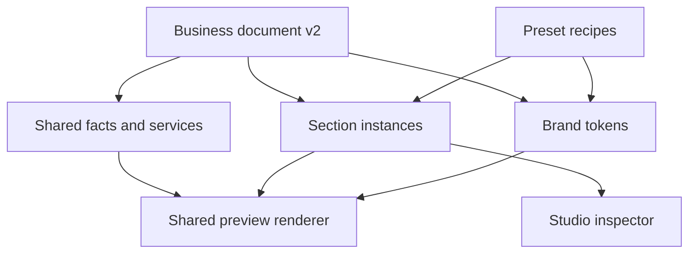

# Business templates and reusable section system

## Current contract — package1.16 / P02.5

The initial new-website audience is freelancers, consultants and small digital-service agencies. Existing sites remain niche-independent registrations. P02.5 repairs Studio and adds owner-only permanent site-record removal: collapsible workspace navigation (collapsed on Studio entry), bounded independently scrolling panels, whole-card section selection, canvas-local selected-section scrolling, homepage Hero/FAQ placement rules, explicit legacy order repair, 120-character headline/320-character hero introduction with counters, bounded responsive photo frames with fitting/focus, optional shared HTTPS logo, sample-fill with confirmation/Undo, section navigation/mobile menu and focused Professional Practice/Creative Business styling. Shared rendering serves preview and existing snapshot publication. No silent legacy row rewrite or automatic sample save/publish.

Additive029_business_studio_and_site_removal.sql preserves001–028. It accepts optional logo/photo metadata, keeps legacy read compatibility, enforces editorial rules on new saves/publication, and exposes owner-only version/name-confirmed bz_delete_site. Site removal cascades this site's business draft/public snapshots/history, knowledge/revisions/events and agent preferences, retaining a content-free owner-readable removal event. External hosting and original portfolio projects remain intact. This is permanent removal, not archiving/restoration. Old duplicate records are removed individually by their owner; no automatic merge.

The first agent pilot is now drafts only for doitwithai.tools: blog, Pinterest copy+rendered graphic, LinkedIn post and rendered carousel/PDF. This phase documents the pilot; live model execution and visual generation are not implemented here. Five proposed roles (coordinator, writer, QA, Pinterest, LinkedIn) share a future visual composer. Social OAuth and CMS writes are not prerequisites for draft generation. Model provider qualification/binding/enforced budget and stored runs remain prerequisites. Multipage/custom collections/listing-entry/navigation/media uploads/gallery/video blocks remain planned; current business sites still have one homepage with section navigation.34 contains current repairs/manual cases;35 contains pilot briefs and owner-reviewable starter knowledge.30 remains cumulative.

Founder reported all newly created Supabase files applied in the review; record this as founder-reported through028 setup, not independently verified database state. Studio/onboarding/deletion findings are open until owner retests1.16. Earlier unspecified acceptance/security gates remain pending. This is a living plan; subsequent founder instructions can revise it, with affected documents, code, migration, dependency and activity records updated together. One cumulative ZIP/repository, two existing Vercel app roots. No remote database/deployment/provider action performed.

Earlier sections remain historical; this current contract supersedes conflicts.

## Historical contract — package1.12 / P02.4

Catalog expanded to six without introducing another section schema or duplicated vertical builder. Wellness/Academy/Product use existing Hero/services/about/FAQ/projects/contact/CTA recipes. Optional genuine testimonials remain user-added. No new fake review content. P02.4 adds Wellness Studio, Education Academy and Product Launch: six business families total. One catalog drives schema, template pages, creation and Studio; the shared section renderer also serves published snapshots. Additive025 expands accepted IDs without rewriting old data. Eight section types/nineteen layouts remain unchanged. No booking, checkout, LMS, enquiry inbox, custom domains or agents are added. See29 for template scope and30 for the combined pending setup/tests. Manual acceptance remains pending.

Older delivery sections retain history; this current contract supersedes conflicting capability/setup statements.

## Historical contract — package1.11 / P02.3.1

Shared section renderer supports saved snapshots; first visible Hero becomes H1 on public pages. Hidden sections are excluded from public payload; unused About/services/items/images are redacted. Empty authoring sections are omitted from visitor rendering. Phone-only Contact is callable; no author instructions are shown to customers. Content/design switching in draft never changes live design until republish. Native business publishing now uses an explicit saved snapshot and `/sites/[siteId]` visitor route. Saves remain private; publishing/republishing/unpublishing use membership checks, draft/publication version conflicts, and additive024. Hidden sections are removed from anonymous payloads; full snapshot history stays member-only. Owner/editor can publish; viewer cannot. Custom domains, enquiry-form delivery and AI agents remain planned. See28 for setup/manual acceptance and ADR-0008 for architecture. Admin app and inherited portfolio remain unchanged.

Earlier release sections retain history and are superseded where they conflict with this current contract.

## Historical contract — package1.10 / P02.2.Fix-1

Stable preset IDs/slugs/content schema/layout catalog remain compatible. Family designs are now visually differentiated in navigation, artwork, type treatment, actions, surfaces and service/project presentation. New-site creation offers all three choices and persists selection via atomic initial draft; demos carry design intent through explicit onboarding actions. Fresh Creative Business starter no longer inherits an unintended FAQ from the default Professional recipe; switching existing designs continues preserving extra sections and approved content.

Earlier release sections retain history; this current contract supersedes conflicting behavior descriptions.

Living specification — Bizoveya1.9 / P02.2. Founder approved research/implementation2026-10-02 00:31:45 PKT. Later requirements may change; record impact, decisions and revised evidence with code.

## Research basis and limits

| Primary source | Finding | Product implication / limit |
|---|---|---|
| [WordPress patterns](https://wordpress.org/documentation/article/block-pattern/) | Reusable block arrangements; synced/unsynced patterns | Modular sections are expected, not unique |
| [Wix Studio sections](https://support.wix.com/en/article/studio-editor-adding-and-managing-sections) | Add, reorder and manage sections | Clear outline and reusable design patterns |
| [Webflow variants](https://help.webflow.com/hc/en-us/articles/51307110086547-Component-variants) | Per-instance component style variants | Separate content and presentation |
| [BrightLocal2025](https://www.brightlocal.com/research/consumer-search-behavior/) | Survey1000 US consumers:85% consider contact/hours important;67% often/always check reviews | Prominent accurate contact and genuine proof; not Pakistan demand evidence |
| [GoDaddy2022](https://www.godaddy.com/resources/news/what-clients-want) |18 interviews and204 US clients who hired professionals | Assisted editing hypothesis; selected sample, not all owners |
| [Wix AI agents](https://support.wix.com/en/article/ai-tools-about-wixs-ai-agents) | Site, marketing and phone agents documented | Agents alone cannot establish exclusivity |

Research checked in the preceding discussion. Two research assistants reviewed editor patterns/customer needs at the owner's request. No client interview, popularity ranking, live competitor usability study, pricing/trademark analysis or revenue prediction is claimed. Validate Pakistan-specific owner behavior with consenting real prospects. Initial test tasks: pick design, enter approved services/contact, switch section layouts, remove an unwanted section, view mobile and update hours. Record task completion, mistakes/help needed, content loss and clarity rather than speed alone.

## Shipped presets

| Stable ID / slug | Family | Composition | Brand |
|---|---|---|---|
| service-studio-v1 / service-studio | Professional Practice | Hero, services, about, FAQ, contact | Mint, editorial serif, split hero/cards |
| local-services-v1 / local-services | Local Services | Hero, services, about, FAQ, contact, CTA | Blue, modern sans, centered hero/list |
| creative-business-v1 / creative-business | Creative Business | Hero, projects, services, about, contact | Amber, editorial serif, expressive hero/rows |

Samples are fictional and contain no fake review, contact details, credentials or result claims. Workspace users choose a recipe under Business & brand; demo edits are not automatically transferred. More archetypes planned after feedback: appointment requests, education and food/location. These are workflow hypotheses, not ranked market demand. Actual booking availability, ordering/payment and LMS need separate functional implementations.

## Section capabilities

| Type | Layouts | Content binding |
|---|---|---|
| Hero | split, centered, editorial | shared headline/introduction; optional section image and eyebrow |
| Services | cards, list, rows | shared1–6 services; local heading/introduction |
| About | split, text | shared story; local heading/optional image |
| Testimonials | cards, featured, slider | up to8 permissioned quotes/attributions/photos |
| Projects | grid, featured | up to8 approved stories/photos |
| FAQ | accordion, list | up to8 approved questions/answers |
| Contact | panel, compact | shared email/display phone/location/hours; local heading |
| CTA | banner, centered | local heading/body; shared contact destination |

19 layout choices total. Each instance has stableID, visibility and base/soft/accent tone. Changing layout keeps its complete content, even when a layout hides a field/item. Featured testimonial displays first item; all others remain stored. Manual slider has previous/next, no autoplay. Contact anchors target a visible contact instance, otherwise email/service fallback; no link to a removed contact section. Optional photographs are public HTTPS references, loaded directly using unoptimized Next Image; malformed/unsafe references rejected and failed images collapse to text. No media upload library.

## Architecture and reuse

One schema/catalogue, renderer and Studio support all presets. A recipe rearranges existing instances, applies safe layout/tokens and adds empty missing sections; it preserves existing IDs, facts, extra sections and content. Refuse a switch if additions would exceed20; never truncate data. Adding a section uses a collision-free ID. Duplicate copies local content; shared facts remain shared. Visibility/reorder are presentation edits, not new content copies.

## Data and compatibility

Schema-v1 remains valid inSQL. Stored reads upgrade to v2 without writing. Legacy fields survive; About starts hidden if story empty. Save validates v2 and uses the same site/member/role gate and expected-version RPC.022 preserves existing rows, table/RLS/grants and001–021 history. JSON backups restore either validv1 orv2 as unsaved content.30-edit local undo/redo is not persistent history. App limits60KB JSON and bounded fields; business API body64KiB; existing other APIs remain16KiB.

## Dependency/change procedure

A new section/layout requires schema/catalogue, renderer/inspector, SQL forward migration, invalid/valid/permission tests, example preview, manual/spec and screenshot updates. A preset built from supported capabilities needs recipe/catalogue, demo route/card/sitemap and preservation tests. Never rewrite applied migrations. Future agents discover approved capabilities and stableIDs through a bounded tool; no agent integration is present now. Admin template management must not enable arbitrary executable code.

## Release gates and next work

Local tests/build/SQL/browser evidence is under docs/delivery/P02.2. Hosted save/reload/concurrency/roles and founder design approval remain manual gates in25/23. P02.3 next: approved business publication and operational contact readiness; P02.4 later: expand validated families. P03knowledge/P04agents remain planned. Avoid unbounded template expansion delaying the first useful controlled agent workflow.
