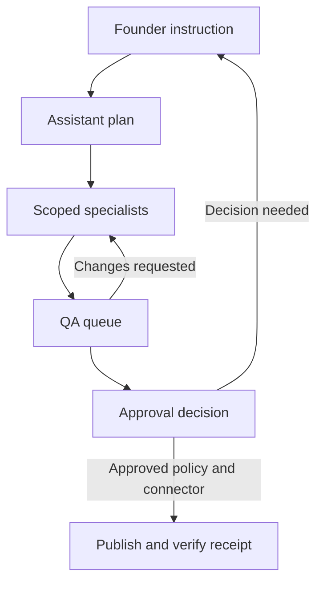

# Evolution record: templates, voice and the visual digital agency

Documentation checkpoint: 2026-10-08 PKT. Founder ideas and assistant recommendations are distinguished below. This is a design/roadmap record, not a feature release, performance claim or permission to publish. Implementation remains unchanged from main 4f719f78.

## Discussion-by-discussion trace

| Order / received context | Founder statement or request | Resolution and status |
|---|---|---|
| 1 — after visual delivery; 02:09 PKT context | All four requested visual checks completed; results liked. Asked to use Plus instead of paid API for stronger text/images. | MT145–147 founder-reported passed. Other tests remain pending. Official subscription route investigated; no connection implemented. |
| 2 — 02:16 PKT | Recognized reusable composition produces the graphics; wants design variety and unique images for commercial users, with Gemini wording. | Separate template graphics from original artwork. Template gallery and standalone LinkedIn image proposed; uploads/image providers later. Free-tier eligibility/capability is provider-specific and is not promised. |
| 3 — 14:34 PKT | Private AI-created reusable templates; personal credentials; specialists aware of template inventory; custom/hireable agents; founder/assistant/HR rooms; voice commands; cartoon office; QA queue, approval/publisher, recovery/escalation; all-agent announcements/meetings to control credits. | Long-term product direction recorded. Assistant recommends structured design specs, private ownership, durable events, safe pauses, bounded recovery and configuration-based custom agents. No new runtime capability claimed. |
| 4 — 14:58 PKT | Document all discussions and affected architecture, phases, activity and manuals before implementation. | This documentation-only checkpoint; next implementation remains separate. |

Times identify received conversation context, not measured test execution times. No visual files, precise saved visual version or independent production inspection were supplied with the broad pass statement. Prior exact generation/review evidence remains in48.

## Current baseline and evidence limits

Gemini already completed the private Blog/Pinterest/LinkedIn text pilot; source run80091597 and accepted reviewv1 remain recorded in48. Bizoveya's deterministic composer renders two Pinterest layouts and six LinkedIn carousel slides from approved text, with local PNG/PDF exports and private saved versions. It does not generate photographs or original illustrated scenes. The starter wording comes from actual accepted output; optional field samples in49 were layout-test replacements, not the only supported content.

Founder confirmation covers the four prescribed checks: storage/composer setup, visibility, reviewed save plus refresh, and opening two PNGs and six-page PDF. MT145–147 are reported passed. It does not independently establish migration history, every role/security case, concurrency, mobile rendering, optional visual JSON/individual slide export or commercial conversion. MT148–151 remain pending. Short-blog depth and unevidenced earlier negatives remain open. Existing automated490-test/both-build/SQL/render evidence belongs to the visual source delivery, not newly executed feature tests in this documentation checkpoint.

## Product direction and privacy

The founder operates a digital agency through an assistant. General specialists are available to hire/configure; additional personal agents can be configured later. An initial analyst can inspect approved website/social sources and propose a grounded plan. Founder assistant combines coordination and proposed HR/onboarding duties: receive requests, assign specialists, track dependencies, report blockers and request founder decisions. Hiring means enabling a scoped role/workflow, not transferring credentials or granting publication authority.

Shared Bizoveya templates are visible to users of the shared catalog. Personal templates are visible only to their creator by default; use within a site/workspace requires an explicit authorized scope. Shared workspaces must not accidentally make every personal template visible to other members. The founder's privacy requirement is accepted; exact personal/workspace sharing UX remains an implementation decision. Administrative access alone must not expose private template contents.

Reusable template definitions and completed visual artifacts are separate, immutable-versioned records. An artifact pins the template version, source text/review version and brand values. Editing a template does not modify existing saved designs. Specialists resolve only authorized inventory and respect a requested template; recommendations are proposals, not silent overrides.

## Template design and media boundary

Proposed first catalog: headline, tip, checklist, comparison, quote and editorial/abstract layouts. Start with a small tested set rather than claiming every family already exists. Each has suitable Pinterest, LinkedIn image or carousel variants where useful. User edits remain previewed, fit-checked, reviewed and saved before export. Text/brand/layout changes can yield varied graphics without an artwork provider; uniqueness is not guaranteed by rotating colors.

Later AI template creation returns a constrained design specification: allowed text areas, shapes, typography, palette, positions and renderer version. Validate dimensions, font/asset allowlists, contrast, overflow, complexity and supported nodes. Do not execute AI-authored arbitrary JavaScript, HTML or remote SVG. Users preview and explicitly save a private reusable template; a specialist cannot expand permissions or auto-share it.

A standalone photographic/illustrated image with no editable overlay is a flattened artwork asset. It requires user upload, reviewed licensed media or a qualified image-generation provider. Store provenance/rights/source and private access; decide upload limits, retention and URL fetching rules before enabling it. Editable carousels/templates remain separate from flattened image generation. Richer media follows the template baseline.

## Subscription integration research — checked 2026-10-08

Official documentation describes eligible ChatGPT plan usage via Sign in with ChatGPT, including an open-source/local path. Paid or remotely hosted apps are directed to an interest process; Bizoveya does not have evidenced partner authorization or a registered integration. User sign-in alone is not inference permission. Usage consumes existing plan allowance, not an extra quota, and does not import conversations/memories.

The documented preview excludes image-generation tools and audio/video inputs/transcription; it must not be presented as a subscription-backed image or voice engine for Bizoveya. Text design-spec generation is a possible future qualified use, not proven access. Each customer must authorize their own eligible account; the founder's subscription must not become a shared customer credential. Stop on usage limits; no automatic paid fallback or extra-credit purchase. Provider authentication, per-user credentials, revocation, protected token storage and existing run/accounting contracts need explicit design/evaluation before integration. Ordinary provider calls remain separately configured.

Sources, recheck before implementation:
- [Official plan-usage overview](https://developers.openai.com/siwc/token-sharing-open-source)
- [Commercial client registration](https://developers.openai.com/siwc/request-client-id)
- [Preview capability limits](https://developers.openai.com/siwc/token-sharing-open-source/preview-limitations)
- [User usage and consent](https://learn.chatgpt.com/docs/sign-in-with-chatgpt)

## Event-driven agency and rooms

Founder room, assistant/HR room, specialist rooms, QA queue, approval desk and meeting room are proposed visual surfaces. Cartoon presence represents durable states and events, never simulated successful work. Every movement/queue item maps to a task, actor, checkpoint and authorized visible status. Disconnected/reconnecting/stale views are explicit. Offer a normal accessible task list and reduced-motion mode; room animation is optional and reveals no private prompts or credentials.

Example founder command: “I launched a new blog. Prepare LinkedIn and Pinterest drafts using my approved templates.” Assistant verifies the authorized source, prepares a plan, assigns two specialists, receives their saved artifacts, queues QA, and routes required founder approval. Facebook and publisher roles are later capabilities, not active today. QA can serialize according to visible queue order or use bounded approved concurrency; dependency/capacity/priority rules must be explicit. Approval and final write/readback are separate states. A failed request keeps its artifact and audit trail.

This diagram is future topology, not an implemented publishing workflow. Current drafts remain private. Future standing auto-publication policy must be explicitly scoped by account/channel/action/cost/time/revocation; meeting attendance or positive QA cannot create it. Current prohibition on customer publication remains effective.

## Meetings, voice and cost control

Two meeting modes extend the existing facilitated meeting contract in06: (a) announcement broadcast, record once and distribute a versioned approved update; (b) deliberation, invoke only relevant specialists with bounded turns. Each role records acknowledgement or unapplied status. An announcement is not permission to overwrite every agent's immutable rules, in-flight snapshot or approved knowledge. Founder confirms important changes; tasks link to the decision and exact preference/knowledge versions.

Example announcement: “We are adding a new service. Propose content updates for the relevant channels.” Capture transcript, proposed facts, affected roles, proposed changes, founder confirmation, acknowledgements and follow-up tasks. Do not publish unverified service claims. Each specialist reacts when needed; cached valid summaries and deterministic event fan-out avoid one model call just to listen. Cost savings are a hypothesis to measure using actual calls/tokens/latency; room animations do not save credits by themselves.

Meeting requests stop scheduling new work and invite agents at safe checkpoints. Active provider calls or atomic writes complete/reconcile before joining; show waiting/finishing status. Preserve tasks, leases and external receipts across pause/restart. Founder voice commands pass through the same typed authorization, budget and approval boundary as clicks. Provide transcript correction/text fallback and explicit confirmation for material actions. Microphone consent, voice provider/account capability, retention and accessibility are separate prerequisites; voice is not implemented by this checkpoint.

## Recovery and custom-agent boundaries

Retry only eligible transient failures, with bounded attempts/backoff, fresh admission and idempotency. Unknown provider costs or uncertain external writes require reconciliation before another attempt. Escalation: specialist → assistant → founder; missing credentials, unsupported capability, uncertainty or repeated failure must be visible. Assistants cannot raise their own budget or tools. Emergency stop blocks new work but cannot undo completed publication.

Custom agents initially use configurations: purpose, approved knowledge, tools, typed input/output, model, site scope, budget, approval and evaluation cases. “Hire” activates a checked role/version only after dependencies permit. Arbitrary agent code generation, unlimited self-modification and self-granted tools are outside this initial direction. A general catalog and private configurations remain separate.

## Ordered implementation plan and acceptance gates

| Proposed slice / existing phase | Scope | Entry/exit evidence |
|---|---|---|
| P04.3.4.2 | Shared visual template selection and standalone LinkedIn image | Start from accepted visual baseline; compatible saved v1 documents, source-review/fit checks, consistent preview/export, template persistence and founder checks. No provider required. |
| P04.3.4.3 | Private reusable template definitions and versions | Explicit user ownership/access, immutable artifact references, denial tests, personal inventory and deletion/export policy. |
| P04.3.4.4 | Uploaded/reviewed media and optional qualified AI design specs/artwork | Storage/rights/security limits, provider access/evaluation, per-user credentials and measured budget; subscription route gated separately. |
| P04.6 / P04.4–5 | Founder assistant, analyst/onboarding and configurable hired specialists | Approved-source analysis, durable delegation/tool contracts, evaluation, scoped activation, trace/recovery and limits. |
| P06.1 | Announcement broadcast and bounded deliberation | Versioned transcript/decision/acknowledgement, safe pauses, resume and no duplicated effects. |
| P06.2 | Voice entry and accessible text fallback | Provider proof/consent, transcript correction, parity with existing permission/approval controls. |
| P06.3 | Visual office and meeting-room projection | Real durable event projection, reconnect/stale states, task-list parity, privacy and reduced motion. |
| P04.7 | Private custom-agent configuration and catalog hiring | Existing tool allowlist, evaluation/activation, private scope, no self-granted authority. |
| P05/P07 | Approved CMS/social execution and recovery | Verified connector permissions, idempotency, receipt/readback, standing-policy scope or per-action approval. |
| P11 | Commercial release | Fresh-user workflow, outstanding access/concurrency/mobile cases, content/visual quality, measured costs, privacy/support/quotas. |

These are planned substeps within existing grand phases, not new completed phases. Exact first catalog/limits and agent/voice providers remain open; documentation completion does not authorize every future hosted action. No deadline or guaranteed market response.

## Change-impact and continuation

Update requirements02, architecture04, memory05, operations06, connectors07, security08, design09, phase ledger10, manual13, commercial15, discussion17, admin18, dependencies19, tests30 and continuation together when implementing affected contracts. Existing business website templates26/29 are distinct from campaign visual templates. Canonical Markdown projects into the main document room; future private rooms remain separate from public project documentation.

Next implementation is a separate checkpoint. Resolve remote main, inspect lease/branches/PRs, retain migrations001–039 and successful run80091597. No need to repeat confirmed generation or visual tests. Unrelated tests/short-blog quality remain open. No new setup, field, key, SQL or provider call is required to read this documentation.
